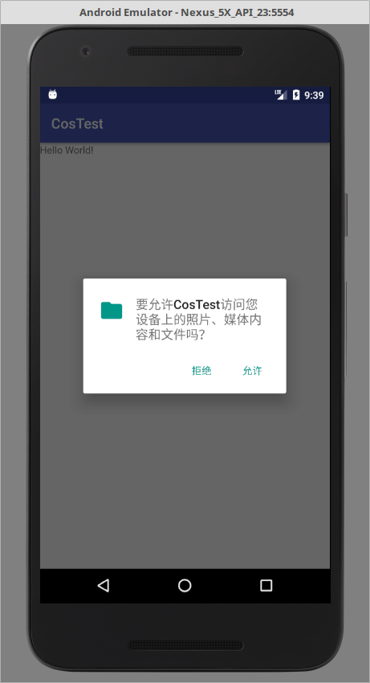

# Android 6.0以上动态申请文件读写权限

## 一、概述

自Android 6.0开始，Google开始对系统权限做出严格的要求，有些权限必须用户同意才能调用相应功能，所以开发者需要调用权限申请的代码，弹出一个小窗口，向用户动态申请权限。如图所示：



文本介绍动态申请文件读写权限的过程。

## 二、申请权限

> Android 中的所有权限可以参考：[https://developer.android.google.cn/reference/android/Manifest.permission](https://developer.android.google.cn/reference/android/Manifest.permission)

我们以读写闪存的权限为例，向申请权限，读与写的权限先定义到静态字符数组中，如下代码

```java
private static String[] PERMISSIONS_STORAGE = {
    Manifest.permission.READ_EXTERNAL_STORAGE,
    Manifest.permission.WRITE_EXTERNAL_STORAGE};
```

首先判断当前系统是否是Android6.0(对应API 23)以及以上，再判断是否含有了写文件的权限，如果没有则调用动态申请权限的代码。使用`ActivityCompat.requestPermission`进行动态申请权限，下面是参数说明

- 1. 第一个参数是目标Activity,填写this即可
- 2. 第二个参数是String[]字符数组类型的权限集
- 3. 第三个即请求码，需传入一个整型数值

代码如下

```java
if (Build.VERSION.SDK_INT > Build.VERSION_CODES.LOLLIPOP) {
    if (ActivityCompat.checkSelfPermission(this, Manifest.permission.WRITE_EXTERNAL_STORAGE) 
    != PackageManager.PERMISSION_GRANTED) {
        ActivityCompat.requestPermissions(this, PERMISSIONS_STORAGE, REQUEST_PERMISSION_CODE);
    }
}
```

回调处理，申请权限后回调到`onRequestPermissionResult`方法，第一个参数为请求码，第二个参数是刚刚请求的权限集，第三个参数是请求结果集。请求结果中，0表示授权成功，-1表示授权失败：

```java
@Override
public void onRequestPermissionsResult(int requestCode, @NonNull String[] permissions, @NonNull int[] grantResults) {
    super.onRequestPermissionsResult(requestCode, permissions, grantResults);
    if (requestCode == REQUEST_PERMISSION_CODE) {
        for (int i = 0; i < permissions.length; i++) {
            Log.i("MainActivity", "申请的权限为：" + permissions[i] + ",申请结果：" + grantResults[i]);
        }
    }
}
```

## 四、完整代码

```java
public class MainActivity extends AppCompatActivity {
    //读写权限
    private static String[] PERMISSIONS_STORAGE = {
            Manifest.permission.READ_EXTERNAL_STORAGE,
            Manifest.permission.WRITE_EXTERNAL_STORAGE};
    //请求状态码
    private static int REQUEST_PERMISSION_CODE = 1;

    @Override
    protected void onCreate(Bundle savedInstanceState) {
        super.onCreate(savedInstanceState);
        setContentView(R.layout.activity_main);

        if (Build.VERSION.SDK_INT > Build.VERSION_CODES.LOLLIPOP) {
            if (ActivityCompat.checkSelfPermission(this, Manifest.permission.WRITE_EXTERNAL_STORAGE) != PackageManager.PERMISSION_GRANTED) {
                ActivityCompat.requestPermissions(this, PERMISSIONS_STORAGE, REQUEST_PERMISSION_CODE);
            }
        }
    }

    @Override
    public void onRequestPermissionsResult(int requestCode, @NonNull String[] permissions, @NonNull int[] grantResults) {
        super.onRequestPermissionsResult(requestCode, permissions, grantResults);
        if (requestCode == REQUEST_PERMISSION_CODE) {
            for (int i = 0; i < permissions.length; i++) {
                Log.i("MainActivity", "申请的权限为：" + permissions[i] + ",申请结果：" + grantResults[i]);
            }
        }
    }
}
```
