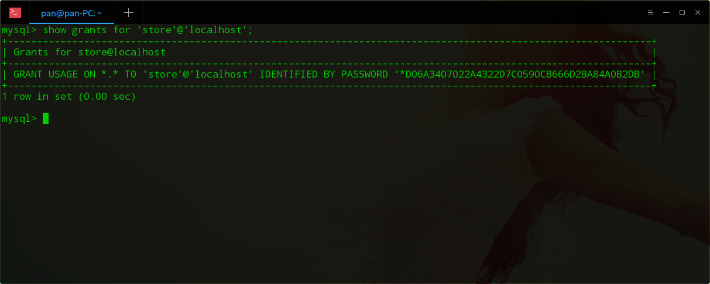
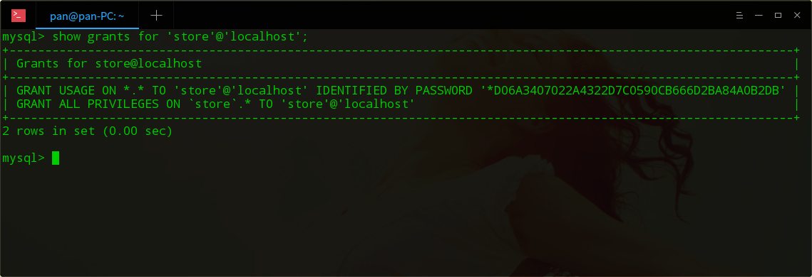

# MySQL怎样给普通用户分配权限？

## 1、为什么需要普通数据库账号

假设有一个包含多个数据库的MySQL服务，假如我们正在开发一个商城网站，商城数据库名为"store"，我们通常不会直接使用root用户对网站进行操作的。通常需要专门针对这个网站程序分配一个MySQL用户，使这个用户对商城网站数据库具有所有的权限，而对其他数据库没有任何权限，这样做也是为了数据库的安全考虑。那么我们将建立一个"store"用户，并赋予它对store库操作的权限。

## 2、创建用户

创建用户命令格式如下

```sql
create user '用户名'@'允许访问的主机' identified by '密码'; 
```

创建一个只允许本机登录的用户

```sql
create user 'store'@'localhost' identified by 'store2018';
```

如果希望用户能在所有主机登录，那么我们需要使用通配符，如下代码:

```sql
create user 'store'@'%' identified by 'store2018';
```

## 3、授予权限

(1)查看用户所具有的权限，格式如下：

```sql
show grants for '用户名'@'主机名';
```

查询store用户在本地所具有的权限：

```sql
show grants for 'store'@'localhost';
```

结果如图所示：


我们可以看到已经赋予的权限列表，或者我们可以使用下面代码查看store用户所具有的权限的详细信息：

```sql
select * from mysql.user where user='store' and host='localhost' \G;
```

以上/G 的作用是将查到的结构旋转90度变成纵向显示。

(2)赋予用户权限:

格式如下：

```sql
grant 权限列表 on 数据库及其表名 to '用户名'@'主机地址';     --权限列表：多个权限使用","隔开，赋予所有权限时直接使用all--
flush privileges;                                      --刷新权限，进行权限操作之后要执行刷新权限代码--
```

赋予store用户在store库的所有表上具有所有权限:

```sql
grant all on store.* to 'store'@'localhost';
flush privileges;
```

我们再次查看store用户所具有的权限时，可以看到和未赋予权限前的结果不一样了，如下图：


## 4、总结

MySQL普通用户通常用于在软件开发项目时，使用该用户对数据库进行增删该查。除此之外，还可以对用户权限进行相应的修改，如撤销权限、赋予更多的权限，等等。更多内容可以参考官网文档，这里不再介绍。
