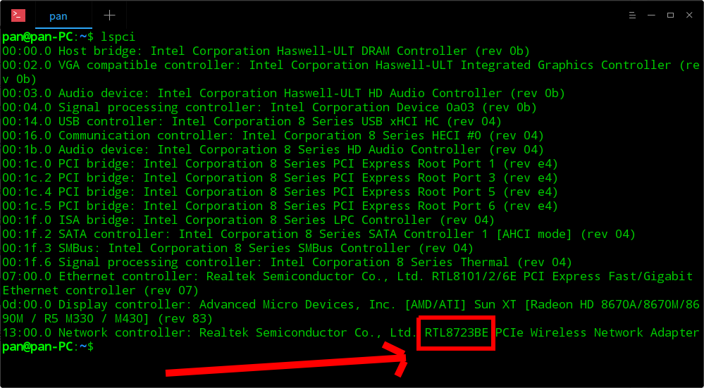
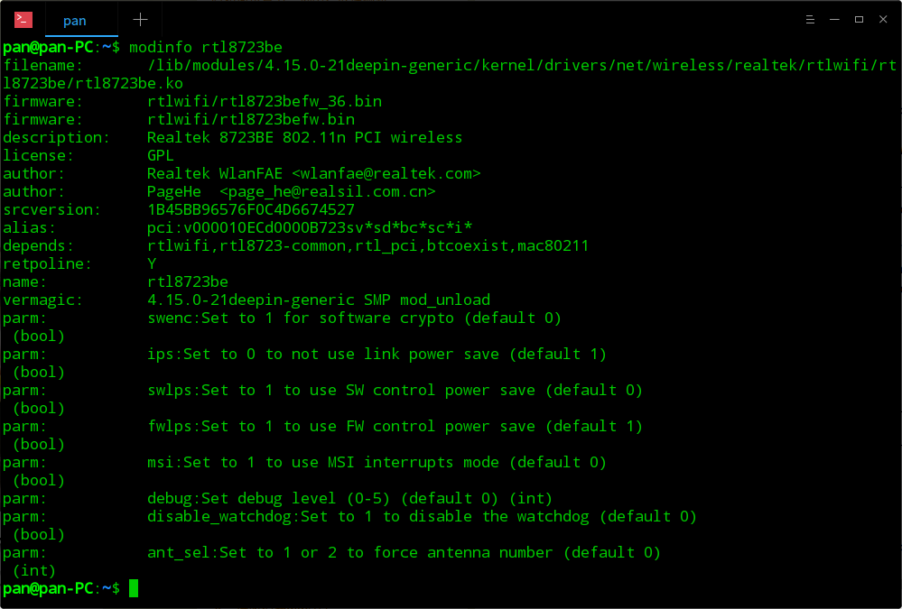
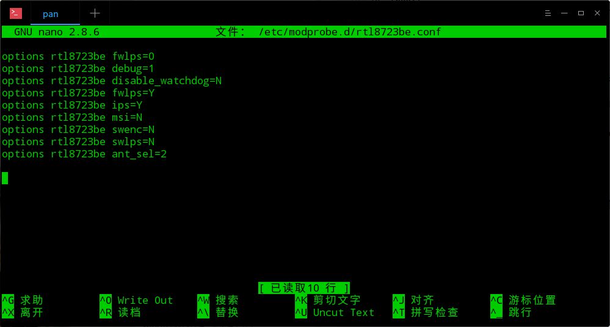

# 解决RTL8723BE网卡Linux上WIFI信号信号差的问题

## 一、问题描述

我电脑一直装这双系统，遇到一个问题就是：在Windows 10上WIFI信号正常，但是在Linux上只接收到几个无线网络的信息，并且很微弱。曾尝试过多个Linux系统，如Ubuntu、Linux Mint、Deepin等等，都无济于事。

## 二、原因

我在网上寻求帮助，发现网友也遇到这个问题，现在终于解决了这个问题！问题在于当前的操作系统配备的无线网卡的参数为省电节能模式，信号强度不行。需要修改参数来重启下wifi，就可以了。

## 三、解决办法

- (1)输入lspci 命令显示系统中所有PCI总线设备或连接到该总线上的所有设备的工具

```shell
lspci
```

可以看到以下信息


当前网卡型号为型号为RTL8723BE，网上说RTL8723系列的网卡都有这个问题，现在我们需要修改一下参数即可.

- (2)查看一下网卡的参数信息：

```shell
modinfo rtl8723be
```

看到以下信息


ips和fwlps是用来控制节能的，ant_sel是用来控制信号强度的。现在需要修改这几个参数的默认值。

- (3)打开网卡配置文件

```shell
sudo nano /etc/modprobe.d/rtl8723be.conf
```

并且在文件中追加以下内容：

```shell
options rtl8723be debug=1
options rtl8723be disable_watchdog=N
options rtl8723be fwlps=Y
options rtl8723be ips=Y
options rtl8723be msi=N
options rtl8723be swenc=N
options rtl8723be swlps=N
options rtl8723be ant_sel=2
```

如图所示

完成之后按Ctrl+O后按回车保存，再按Ctrl+X退出。

- (4)输入以下命令重启之后信号就变强了，可以看到搜到更多无线网信号了

```shell
sudo modprobe -r rtl8723be
sudo modprobe rtl8723be
```
