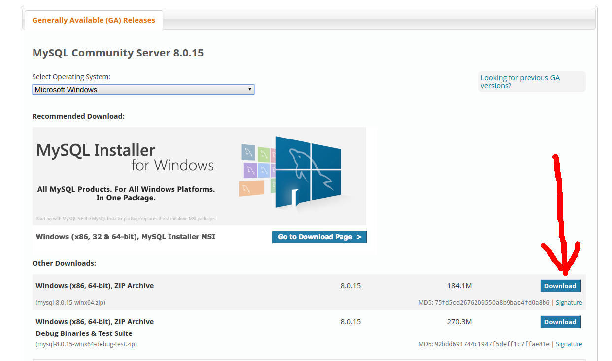

# 如何在Windows上安装和使用MySQL8.0数据库

> 撰写时间：2019-03-31 17:06，整理时间：2022.07.14

如何在Windows安装和使用MySQL 8.0数据库：

## 一、简介

之前，我分享了《如何在Linux服务器上安装MySQL 8.0数据库》，教程链接：[https://www.bilibili.com/video/av48488984](https://www.bilibili.com/video/av48488984)，今天给大家分享一下如何在windows上安装和使用MySQL 8.0数据库，MySQL官方给我们提供两种安装包：

### 1.exe可执行安装包

这个类型的安装包也就是图形化安装包，很简单，程序会默认安装到Windows的程序默认安装目录。也就是`C:\Program Files\`或者`C:\Program Files (x86)\`。

### 2.zip压缩包

官方将已经编译好了的MySQL可执行程序文件和配置文件打包成一个zip格式的文件，我们在安装时可以直接解压到电脑文件目录上。因为exe可执行安装包的安装方式比较简单，直接根据提示一路的“下一步”就完成了，今天给大家演示zip压缩包的安装方式。

## 三、工具

- Windows 10
- MySQL 8.0.15

## 四、安装步骤

（一）解压安装包到安装目录

（二）创建一个配置文件

（三）选择MySQL服务器类型

（四）初始化数据目录

（五）第一次启动MySQL服务器

（六）通过命令行启动和关闭MySQL服务

（七）将MySQL自带工具添加到环境变量中【非必须选操作】

（八）将MySQL注册为为Windows的服务【非必须选操作】

（九）测试你安装MySQL服务【非必须选操作】

（十）更改数据库账号验证方式与密码加密方式【非必须选操作】

## 五、安装过程

安装之前，我们先下载安装包，如图所示：


下载链接：[https://dev.mysql.com/downloads/mysql/](https://dev.mysql.com/downloads/mysql/)

### 5.1 解压安装包到安装目录

因为我们是全新安装，所以不考虑其他情况，根据官方文档，我们可以直接把解压之后的内容放在C:\mysql，当然，你可以选择其他合理的目录（注意：避免中文目录）；

有的解压工具解压之后会有两层目录，直接把里面那层提取出来重命名即可；

### 5.2 创建一个配置文件

如果你想在运行MySQL数据库服务的时候指定一些参数，那么你就可以在命令行中声明，或者使用一个配置文件来代替，MySQL服务在运行的时候会去读取配置文件的内容。当然了，我们使用配置文件的方式指定运行时的一些参数是最方便的。

当MySQL在Windows中启动时，它会从多个地方查找配置文件，比如C:\还有MySQL的安装目录。MySQL会寻找名为my.ini的文本配置文件，所以，为了避免冲突，最好只使用一个配置文件。

如果我们的安装目录在`C:\mysql`，数据的保存保存目录在`C:\mysql\data`，那么我们可以在mysql安装目录创建一个`my.ini`文件，并使用一个文本编辑工具（如Notepad++定义）我们的参数，我们需要创建一个`[mysqld]`节点，并写入如下内容

```ini
[mysqld]
# 指定mysql的安装目录
basedir=C:/mysql
# 指定数据保存的目录
datadir=C:/mysql/data
```

反斜杠（/）是Unix风格的目录分割符号，MySQL会识别并解析，你可以使用Windows的文件路径分割符号--斜杠（\），但是官方说明的是，一定要使用双斜杠，如下内容

```ini
[mysqld]
# 指定mysql的安装目录
basedir=C:\\mysql
# 指定数据保存的目录
datadir=C:\\mysql\\data
```

### 5.3 了解服务文件类型

下表是MySQL 8.0系列中Windows的可用服务器：

| 二进制文件名 | m描述 |
| ------------ | ---------------------------------- |
| mysqld |支持命名管道的经过优化的二进制文件        |
| mysqld-debug | 和mysqld一样，但是使用完全debug和内存自动检查方式来编译 |

我们这一步暂时不需要做什么，需要了解一下就行了

### 5.4 初始化数据

使用exe可执行文件安装时，数据库初始化是自动的。但是我们使用zip压缩包来安装MySQL是没有默认的数据库，我们需要手动初始化一下MySQL的数据。

我们需打开Windows自带的命令行工具，并且进入MySQL的安装目录，执行以下命令

```bash
bin\mysqld --defaults-file=C:\mysql\my.ini --initialize --console
```

相关初始化参数说明：

- `--defaults-file`：指定我们配置文件所在的位置，我们在上面步骤中把配置文件`my.ini`放在在安装目录中，所以这里的参数值是 `C:\my.ini`

- `--initialize`：进行MySQL初始化，初始化过程会root用户生成可用于本地登录的随机密码，你需要记住这个密码

- `--initialize-insecure`：使用不安全的方式进行初始化，使用这个参数不会生成随机密码，与上main的`--initialize`二选一即可

- `--console`：这个参数代表mysqld在控制台运行

### 5.5 第一次启动MySQL服务器

> 注意:必须先完成初始化才能启动MySQL

- 启动MySQL服务器

通过msqld命令启动服务

```bat
C:\> "C:\mysql\bin\mysqld" --console
```

> 我们在调用命令是使用了双引号，也可以不使用，但如果目录中存在空格，一定用双引号

- 使用root账号登录

通过使用`--initialize`或`-initialize-insecure`初始化之后，可以正常启动服务器，我们需要给`'root'@'localhost'`帐户分配新密码，如果不修改密码，MySQL服务是不能正常使用的

如果使用`--initialize`初始化数据库，使用以下命令，这时候我们输入随机生成的密码：

```bat
bin\mysql -u root -p 
```

如果使用`-initialize-insecure`初始化数据库目录，我们在root没有密码的情况下登录

```bat
mysql -u root --skip-password
```

- 连接数据库之后，使用以下命令修改密码

```sql
ALTER USER 'root'@'localhost' IDENTIFIED BY '你的密码';
```

## 六、通过命令行启动和关闭MySQL服务

下面我们介绍启动和关闭服务的命令

我们可以从控制台窗口启动服务，如下：

```bat
C:\> "C:\mysql\bin\mysqld"
```

我们可以从控制台窗口关闭服务，如下，输入密码后服务就被关闭

```bat
C:\> "C:\mysql\bin\mysqladmin" -u root shutdown -p
```

如果root账号没有密码，不需要加-p参数

## 七、将MySQL自带工具添加到环境变量中【非必须选操作】

这部分是可选的，将MySQL自带工具添加到PATH环境变量中我们会更方便从命令行窗口调用。操作步骤为：在桌面右键单击“ 我的电脑”图标，然后选择“ 属性”->“系统属性”->“高级”->“环境变量”->“系统变量”，编辑 "PATH" 变量，添加mysql安装目录下的bin目录绝对路径即可。

## 八、将MySQL注册为为Windows的服务【非必须选操作】

这部分是可选的，我们可以将MySQL注册为windows服务，方便我们以图形化方式进行启动管理。也可以随时移除，但是在操作前，一定要停止MySQL服务。同时，执行下面操作需要Windows管理员权限，所以我们需要使用管理员身份打开命令行。

- 注册服务

```bat
C:\> "C:\mysql\bin\mysqld" --install mysql --defaults-file="C:\mysql\my.ini" 
```

- 移除服务

```bat
C:\> SC DELETE mysql
C:\> "C:\mysql\bin\mysqld" --remove
```

## 九、测试服务器【可选】

这部分是可选的，你可以通过执行以下任何命令来测试MySQL服务器是否正常工作

```bat
C:\> "C:\mysql\bin\mysqlshow"
C:\> "C:\mysql\bin\mysqlshow" -u root mysql
C:\> "C:\mysql\bin\mysqladmin" version status proc
C:\> "C:\mysql\bin\mysql" test
```

## 十、更改数据库账号验证方式与密码加密方式【非必须选操作】

这部分是也是非必须的操作，在MySQL 8.0系列中，默认的身份验证插件已将`mysql_native_password`更改为`caching_sha2_password`，并且在 `'root'@'localhost'`管理帐户中默认使用`caching_sha2_password`验证方式。

二在撰写这篇文章的时候，很多开源程序如`wordpress`、`typecho`是不可以直接连接的，所以使用MySQL8.0数据库，你可以更改默认验证方式，你还可以新建一个专门用于你项目开发的一个数据库账号，并使用`mysql_native_password`验证方式。

以下更改root用户的验证方式的命令

```sql
ALTER USER 'root'@'localhost' IDENTIFIED WITH mysql_native_password BY '密码';
```

经过我的测试，默认情况下MySQL 8.0使用第三方工具默认也是不能连接的，如果有需要，你需要更改一下密码的加密方式

```sql
ALTER USER 'root'@'localhost' IDENTIFIED BY '密码' PASSWORD EXPIRE NEVER;
```

如果你想同时更改密码验证方式和加密方式，可以直接使用以下命令

```sql
ALTER USER 'root'@'localhost' IDENTIFIED WITH mysql_native_password BY '密码' PASSWORD EXPIRE NEVER;
```

> 原创禁止转载
> 参考：<https://dev.mysql.com/doc/refman/8.0/en/windows-install-archive.html>
