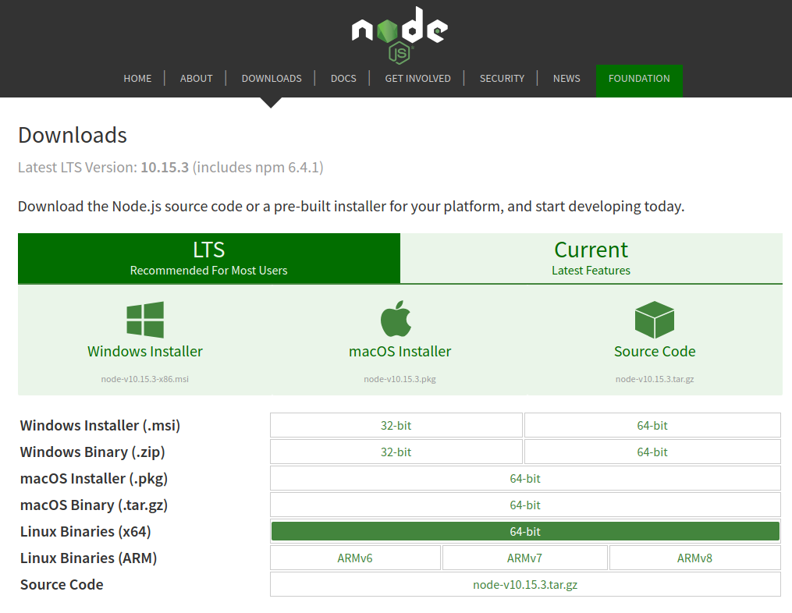
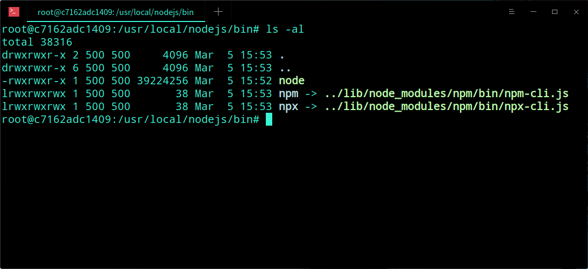

# 怎样在Linux上安装Node.js

## 一、环境

Ubuntu 16.04 Server

## 二、安装步骤

安装步骤很简单，本次不直接从Linux的软件库安装，去官网下载安装，步骤如下：

1. 去官网下载二进制可执行压缩包；

2. 解压到系统目录；

3. 设置环境变量；

4. 安装完成，运行测试。

## 三、安装过程

"#"后面为注释内容，以下操作在root用户模式下进行

### 3.1 进入官网下载

官网下载地址为：[https://nodejs.org/en/download/](https://nodejs.org/en/download/)
直接选择对应版本下载即可，这里选择的是Linux Binaries (x64)，也就是64位处理器的二进制可执行程序包，如图所示：



### 3.2 解压到系统目录

```shell
# 先安装个wget，用来下载node.js安装包
apt install wget
# 下载安装包
wget https://nodejs.org/dist/v10.15.3/node-v10.15.3-linux-x64.tar.xz
# 这个地方，你可能会出错，因为你的系统里没有对应的解压工具，你安装上xz和tar对应工具包就行
tar xf node-v10.15.3-linux-x64.tar.xz
# 将二进制解压目录 移动到系统指定目录，通常是 /usr/local 下
mv node-v10.15.3-linux-x64 /usr/local/nodejs
```

## 3.3 设置系统环境变量

需要把node.js解压目录的二进制文件所在目录添加到系统的PATH环境变量，我们才能顺利在终端中调用。我们可以看到二进制目录下面包含了node可执行文件，还有npm和npx链接文件，如图所示：



在Linux操作系统中，`/etc/profile` 文件是在系统每次开机都会加载这个文件，我们可以在这个文件里定义PATH环境变量，使用vim编辑此文件

```shell
vim /etc/profile
```

在文件末尾追加以下代码：

```shell
export PATH=/usr/local/nodejs/bin:$PATH
```

相关含义

`=`：等号前是变量名，等号后是变量值；

`export`：这个命令的作用是将后面的PATH变量添加到当前系统环境中；

`/usr/local/nodejs/bin`：这个是node.js安装目录下的二进制文件所在目录，也就是node命令和npm的链接文件所在目录；

`:`：半角冒号（英文输入法下的冒号）是Linux系统下的分割符号，相当于windows中的“;”；

`$PATH`：为什么还在后面追加$PATH？首先“$“符号是Linux变量的关键符号，其次，因为PATH环境变量默认情况下就保存了很多的二进制文件所在目录了，如果不加的话相当于对PATH环境变量进行重定义，而不是追加。那样系统就会出问题，其他Linux命令就不能正常调用了。

> 因为文档读者大多是初学者，所以在文中尽量详细说明每一个步骤。

## 3.4 运行测试

编辑完成之后，保存并退出，此时，要让/etc/profile临时在当前终端起作用，执行以下命令。

```shell
source /etc/profile
```

命令调用测试

```shell
#查看node.js的版本信息
node -v
#查看npm的版本信息
npm -v
```

如果正常，恭喜你，安装成功了。
