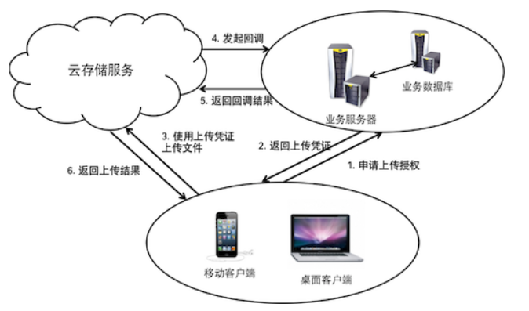

# 怎样使用七牛云JSSDK上传私密文件

## 一、概述

在项目开发中，很多时候用到七牛云对象存储来保存项目的静态文件，如视频、图片、大文件，等等。如果说项目文件涉及到用户隐私，那么文件就不应该被公开读取，而是使用私有的方式去存取。参考链接:[https://developer.qiniu.com/](https://developer.qiniu.com/)

假设项目有这样需求，客户端上传私密图片到七牛云，上传成功后，我们把文件的key键记录在数据库中，下次客户端需要读取图片时，业务服务器通过文件的key键获取临时链接，返回给客户端。

暂且不考虑服务器逻辑，下面是客户端上使用 JSSDK 上传私密文件的简单示例

## 二、具体流程

### 2.1 七牛云上传过程

首先看七牛云官方的一张图，了解七牛云文件上传的大致流程



1. 客户端需要向业务服务器发送请求，获取临时的上传凭证，这里叫做 uploadToken

2. 客户端获取上传凭证之后，可以使用上传凭证向七牛云服务器传文件。这里说的客户端，是Android、iPhone、或者Web浏览器。

3. 上传任务完成之后，七牛云服务器会向项目的业务服务器发出回调，方便业务服务器做后续操作。不过，这个过程是可选的，也就是说，可以不设置回调

### 2.2 代码示例

我们假设服务器代码已经写好，这里暂且不考虑业务服务器的逻辑。我们使用Web浏览器，以一个简单的HTML文件作为示例，使用JSSDK往七牛云服务器传文件。

- 使用CDN的方式，引入jQuery和七牛云JS SDK，如下代码

```javascript
<script type="text/javascript" src="https://cdn.staticfile.org/jquery/3.4.1/jquery.min.js"></script>
<script type="text/javascript" src="https://unpkg.com/qiniu-js@2.5.5/dist/qiniu.min.js"></script>
```

- 在表单里添加一个input用来选择本地文件，使用一个button用来执行取消上传操作，如下代码

```html
<form style="width: 50%;margin: 0 auto">
    <input type="file" id="selectFile" value="选择文件">
    <button id="oncancel">取消上传</button>
</form>
```

- 监听input状态，当input内容有改变时，进行文件上传，如下代码

```javascript
 var subscription = null
    $("#selectFile").change(function () {
        console.log('文件状态有变化')
        // 文件对象
        var file = this.files[0]
        if (!file) return
        // 向业务服务器发送请求获取updateToken
        $.post('https://www.test.com/api/qiniu/getUploadToken', {}, function (token) {
            console.log('返回数据为uploadToken:' + token)
            if (token) {
                // 提交文件到七牛云服务器
                var observable = qiniu.upload(file, new Date().getTime(), token, {fname: file.name}, {useCdnDomain: true})
                // 设置监听者对象
                var observer = {
                    next(res) {
                        console.log('总大小=>' + res.total.size + ',当前已上传大小=>' + res.total.loaded + ',当前进度=>' + res.total.percent)
                    },
                    error(err) {
                        // ...
                    },
                    complete(res) {
                        // ...
                        console.log('上传成功')
                        console.dir(res)
                    }
                }
                // 上传文件
                subscription = observable.subscribe(observer)
            }
        })
    })
```

在以上代码中可以看到，当监听到有文件添加到input标签之后，先发送一个post请求去服务器获取上传凭证。

qiniu.upload(file: blob, key: string, token: string, putExtra: object, config: object)方法参数说明：

- `file`：文件对象，
- `key`：文件的key，用于标识存储桶里的唯一一个文件，
- `token`：业务服务器返回的上传凭证，
- `putExtra`：附加参数对象，我们上面用到的 fname 指定的是原文件名
- `config`：配置对象，useCdnDomain: true代表使用cdn加速域名

七牛云上传方法接收一个监听者对象， 在监听者对象的next回调方法中，接收上传进度信息，res 参数是一个带有 total 字段的 object，包含loaded、size、percent三个属性，提供上传进度信息。

在文件上传完成之后，回调complete方法，返回数据如下

```yaml
hash: "FluHYkQWHigWGQLSe0w9-Jl6b7LA"
key: "1576488908539"
```

### 2.3 取消上传

最后，我们提供一个取消上传的方法

```javascript
$("#oncancel").click(function (event) {
        //阻止默认事件
        event.preventDefault()
        //取消上传
        subscription.unsubscribe()
})
```

## 三、总结

实际上，七牛云对象提供了多种语言版本的SDK，可根据实际需求去下载使用。以上是使用使用浏览器上传文件到七牛云对象存储的简单示例，全部代码如下：

```html
<!DOCTYPE html>
<html lang="en">
<head>
    <meta charset="UTF-8">
    <title>七牛云上传示例</title>
    <script src="https://cdn.staticfile.org/jquery/3.4.1/jquery.min.js"></script>
    <script type="text/javascript" src="https://unpkg.com/qiniu-js@2.5.5/dist/qiniu.min.js"></script>
</head>
<body>
<form style="width: 50%;margin: 0 auto">
    <input type="file" id="selectFile" value="选择文件">
    <button id="oncancel">取消上传</button>
</form>
</body>

<script>
    var subscription = null
    $("#selectFile").change(function () {
        console.log('文件状态有变化')
        //文件对象
        var file = this.files[0]
        if (!file) return
        //发送请求获取updateToken
        $.post('https://www.test.com/api/qiniu/getUploadToken', {}, function (token) {
            console.log('返回数据为updateToken:' + token)
            if (token) {
                //提交文件到服务器
                var observable = qiniu.upload(file, new Date().getTime(), token, {fname: file.name}, {useCdnDomain: true})
                //设置监听者对象
                var observer = {
                    next(res) {
                        // 接收上传进度信息，res 参数是一个带有 total 字段的 object，包含loaded、size、percent三个属性，提供上传进度信息。
                        console.log('总大小=>' + res.total.size + ',当前已上传大小=>' + res.total.loaded + ',当前进度=>' + res.total.percent)
                    },
                    error(err) {
                        // ...
                    },
                    complete(res) {
                        // ...
                        console.log('上传成功')
                        console.dir(res)
                    }
                }
                //上传文件
                subscription = observable.subscribe(observer)
            }
        })
    })

    $("#oncancel").click(function (event) {
        //阻止默认事件
        event.preventDefault()
        //取消上传
        subscription.unsubscribe()
    })
</script>

</html>
```

>原创文章，禁止转载，原作者博客 <https://jiker.dev>
