# 怎样在Linux上开发vue项目

##  一、开发环境搭建：安装node.js环境以及vue cli工具

> 撰写时间：2020-12-07，整理时间：2023-01-29

##  一、开发环境搭建：安装node.js环境以及vue cli工具

### 1.1 安装node.js

从官网下载对应的二进制压缩包，如下图：

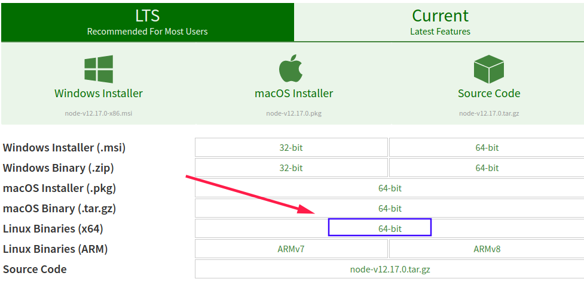

解压到程序安装目录

```shell
xz -d node-v12.17.0-linux-x64.tar.xz
tar -xvf node-v12.17.0-linux-x64.tar
sudo mv node-v12.17.0-linux-x64 /usr/local/nodejs
```

编辑配置文件

```shell
vim /etc/profile
```

将node.js的node可执行可执行文件与npm链接所在目录添加到环境变量，在文件/etc/profile文件末尾添加以下内容

```shell
export PATH=/usr/local/nodejs/bin:$PATH
```

保存文件并执行以下命令

```shell
source /etc/profile
node -v # 查看本地node版本
npm -v # 查看本地npm版本
```

若显示以下类似，则代表安装成功

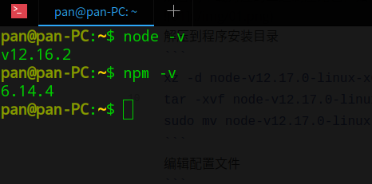

此时，我们还可以设置nodejs在国内的淘宝加速镜像源

```shell
npm config set registry https://registry.npm.taobao.org
```

### 1.2 安装nvm（node版本管理工具）

nvm是node版本管理工具，使用nvm我们可以随时在切换我们本地的node版本。
nvm项目地址为[https://github.com/nvm-sh/nvm](https://github.com/nvm-sh/nvm)
根据文档提示，我们只需执行一下命令即可完成安装：

```shell
curl -o- https://raw.githubusercontent.com/nvm-sh/nvm/v0.35.3/install.sh | bash
```

npm相关指令以及示例：

```shell
nvm -help #查看nvm帮助文档
nvm --version #查看nvm版本号
nvm ls-remote #列出所有可以安装的node版本
nvm install v10.14.2 #指定安装10.14.2版本的node.js
nvm install node #安装最新的node版本（node为最新版本号的别名）
nvm install --lts node #安装最新的node长期维护版本
nvm ls #列出本地安装的node版本
nvm use v12.16.2 #将本地node切换为12.16.2版本
```

### 1.3 安装yarn（node包管理工具）

yarn的中文官网[https://yarn.bootcss.com/](https://yarn.bootcss.com/)
根据官方文档，以Debian/Ubuntu为例，安装步骤如下：
首先配置软件仓库：

```shell
curl -sS https://dl.yarnpkg.com/debian/pubkey.gpg | sudo apt-key add -
echo "deb https://dl.yarnpkg.com/debian/ stable main" | sudo tee /etc/apt/sources.list.d/yarn.list
```

安装yarn包

```shell
sudo apt update && sudo apt install yarn
```

安装完成之后，使用如下命令检测是否安装成功：

```shell
yarn -v
```

如果出现相应的版本号，则代表安装成功。不过要注意的是，用apt安装不一定成功，因为你的操作系统厂商的软件库里不一定包含。此时我们可以使用npm安装，因为在上面步骤我们安装nodejs已经包含了npm，如下代码：

```shell
npm install -g yarn
```

### 1.4 安装vue cli

vue cli官网链接：[https://cli.vuejs.org/](https://cli.vuejs.org/)
使用npm全局安装

```shell
npm install -g @vue/cli
```

或者使用yarn 全局安装

```shell
yarn global add @vue/cli
```

## 二、使用命令行创建vue项目

在创建项目之前，我们可以使用如下命令查看相关的指令帮助文档

```shell
vue -h
```

进入工作目录，创建名为test的vue项目

```shell
vue create test
```

将光标选择到手动选择特性（Manually select features），如下图：

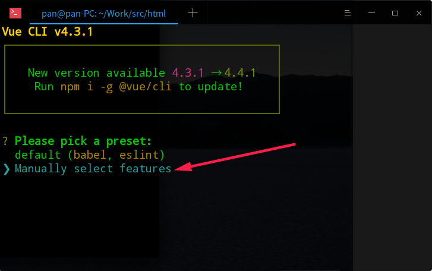

手动移动光标，选择响应的特性，使用空格键勾选或者取消勾选，如下图所示：

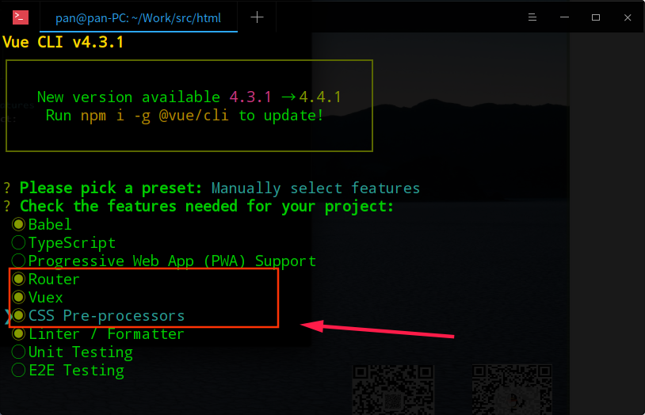

选择router的history模式，如下图：

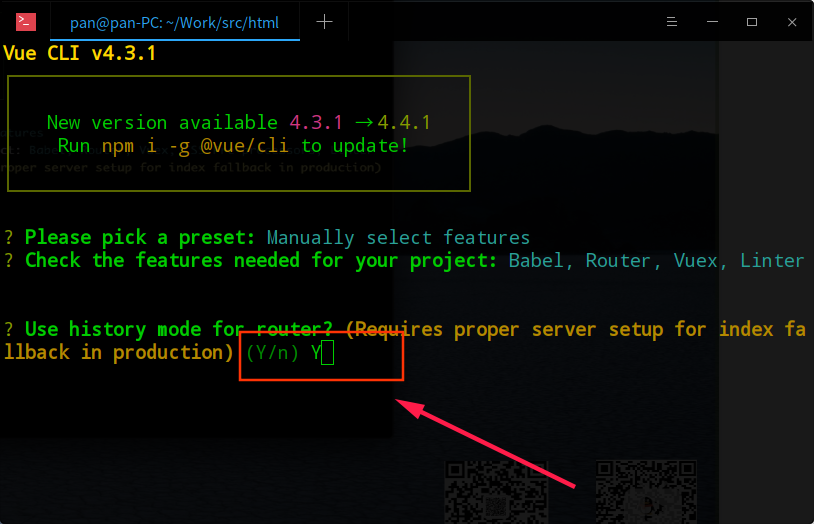

选择node-sass模式，如下图：

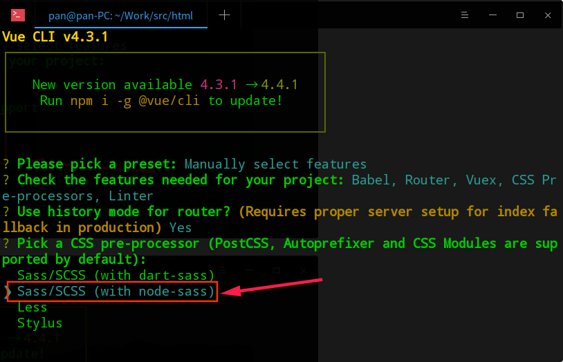

选择eslint的配置，如下图：

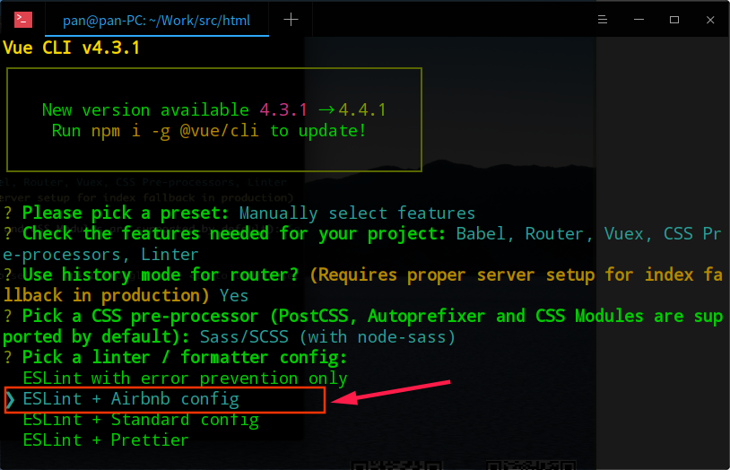

选择eslint保存时检查代码，如下图：

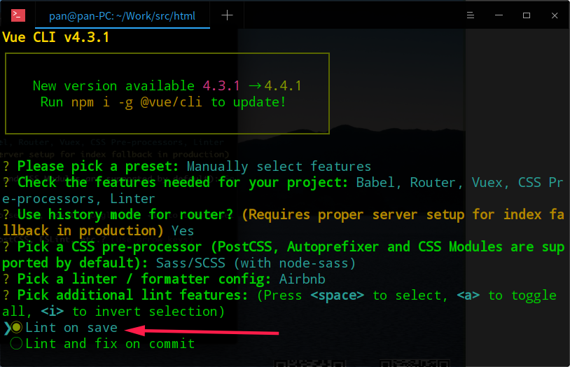

选择将配置文件保存在单独的配置文件中，如下图：

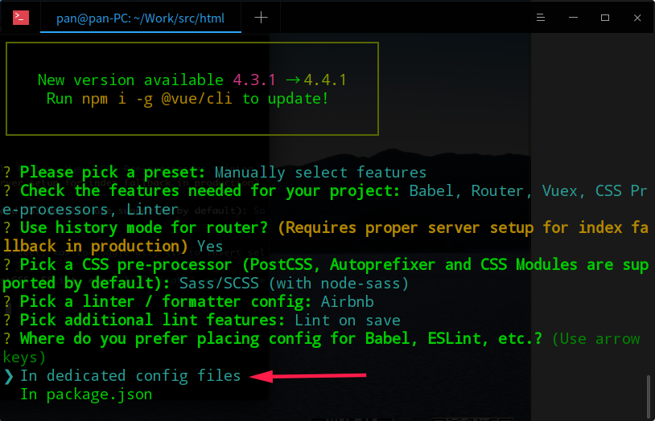

选择时候将设置作为预设，如果输入y，则是，N则否，如下图：

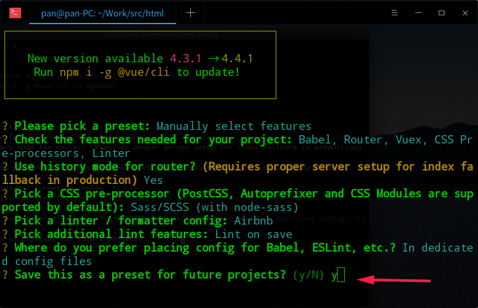

如果选择是，按回车后还需输入预设名，再按回车等待安装即可。如果出现如下如所示则代表创建爱你成功，否则你需要检查一下网络和你的环境，重新创建。

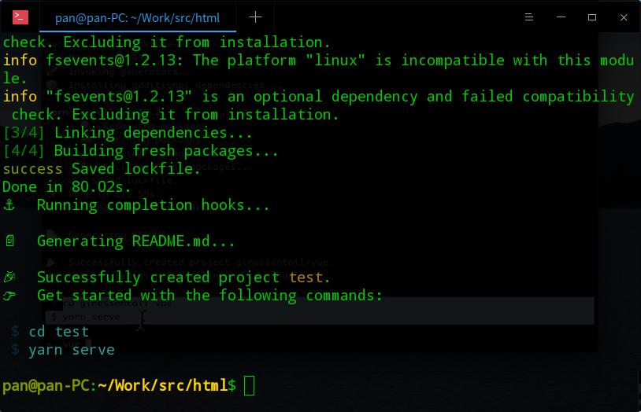
