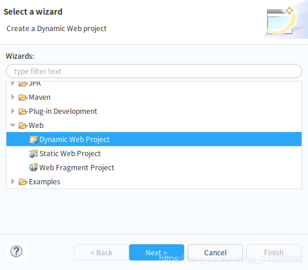
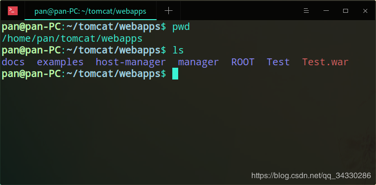
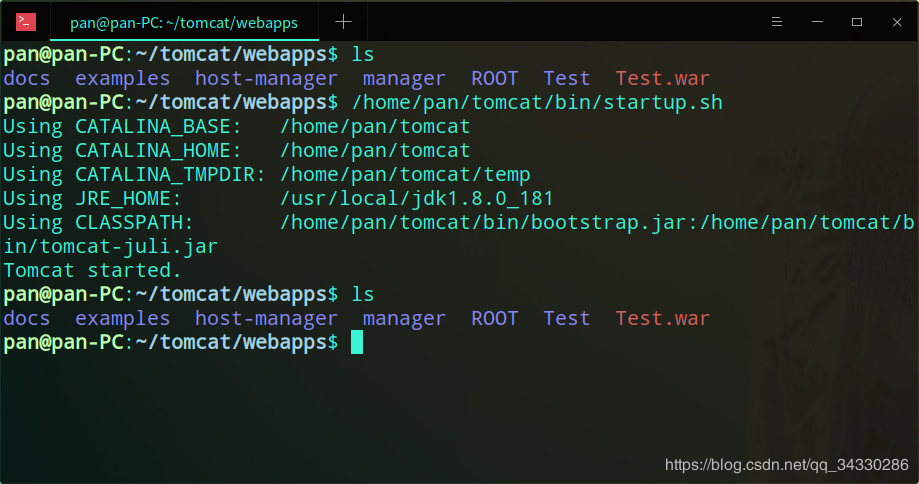
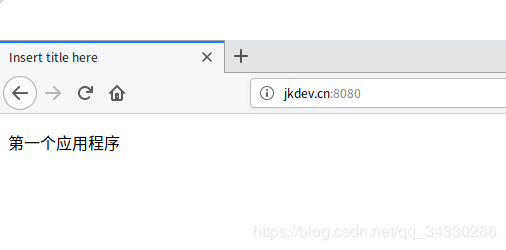

# 怎样把java的war程序包放在tomcat服务器上运行

## 一、简介

很久之前，我做了一个教程“使用阿里云服务器快速搭建个人网站”[https://www.bilibili.com/video/av15159168][1]，这个视频给初学者同学们演示了如何在Debian系列的云服务器上安装tomcat，并使用tomcat环境来托管我们的静态网页。

这视频大多观众是喜欢web开发的初学者们。此博客在这个视频的基础之上写的，如果你不是看过这个视频初学者，最好绕路而行，不然可能浪费你的时间。

实际上，如果我们只是托管静态网页的话，都可以不用自己搭服务器环境，完全可以使用第三方网站提供的webpage服务。tomcat主要是作为java网站的容器。这篇博客演示一下如何将我们的java的war包程序发布的tomcat中。

## 二、演示工具

- 1.Eclipse 2019.03
- 2.tomcat 8.5.39

## 三、本地打包WAR包

### 3.1 在Eclipse中新建一个动态网页项目

如图


我的项目取名为“**Test**”，然后呢，在WebContent目录下新建一个名为`index.jsp`，写一个简单的字符进去。因为这只是示例，实际上你的java动态网页项目可能很复杂，一个完整的项目由很多代码构成、你的程序还要与数据库交互等等。

### 3.2 导出war包

在Eclipse中项目节点右键 Export -> WAR file，配置输出路径就可以导出了，我的路径是 */home/pan/Downloads/Test.war*，如图所示
20190328213818466.png

## 四、配置服务器

### 4.1 上传WAR包到服务器中tomcat解压目录的webapps目录

如图所示


### 4.2 编辑tomcat解压目录下的server.xml文件

在Engine节点下的Host节点下添加以下配置内容

```xml
<Context path="" docBase="/home/pan/tomcat/webapps/Test"/>
```

docBase代表你的项目在服务器上的绝对路径，WAR包在你重启tomcat之后它会自动解压。

### 4.3 重启tomcat

你的域名需要解析到你的服务器ip地址上，这里我绑定的域名是*jkdev.cn*，我们默认使用8080端口，如果你的项目在公网上应该改为80端口。可以看到启动tomcat之后，Test.war被解压了，如图所示：



此时我们通过浏览器访问，就顺利访问到我们的Java动态网页项目了，如图所示：



> 参考apacha官网：[http://tomcat.apache.org/tomcat-8.5-doc/index.html][7]
