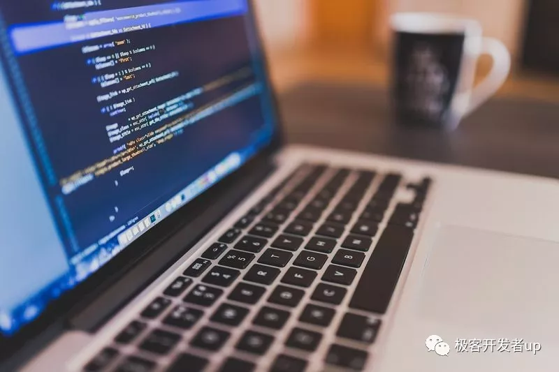

# 我是如何走上PHP程序员这条路的？

> 撰写时间：2019-10-07 22:30，整理时间：2022.07.17

如今工作已经满三个月了，回想过去的种种经历，甚是感慨。今天给大家简单分享一下我是如果走上PHP程序员这条路的。

## 第一次接触代码，什么都不懂

其实在我读大学之前，也就是2015年之前，我很少接触到电脑，但我对电脑软件很感兴趣，所以在那之前，我就决定到大学之后好好学习计算机知识。在大一的时候，学习了C语言，那时候我只知道C语言最终可以开发出软件，其实什么概念都不懂。虽然很感兴趣，上课却听不懂。直到大一上学期结束之后，我连++i和i++都不知道什么意思。

## 我怎么又重拾编程的信心？

我知道，我弄不懂程序肯定是学习方法不对。那时候我对APP很感兴趣，于是上网了解到开发APP需要java语言知识。于是我在网上找了一套java视频，准备好笔记，我每天晚上认真地看一集视频，并且完成视频里的内容。过了一个月，找到感觉了，感觉其实代码并不难。在那之后，真正学会了一些编程的基础，至少遇到问题，自己知道怎么用百度去搜索。从那时候，不断积累基础知识，遇到一个问题解决一个问题。久而久之，需要百度的次数就少了。

其实我们只是没有找到学习方法而已，对于不同的人来说，最好的方法是不一样的，与其问别人，还不如自己探索。世界山并没有谁聪明谁笨一说。就像我现在的leader对我说的，人都是灵长类动物，其实大家的智商都差不多，卖菜的也能和写代码的组成一个家庭。只是写代码的跟卖菜的讲代码的事卖菜的不懂，卖菜的跟写代码的讲卖菜的事写代码的同样生疏。大家都一样，根本不存在什么高学历和低学历之分，卖菜的和写代码的在一起谈感情就不会存在什么问题。

## 我的学习经历

自从开始编程这条路之后，我就决定往下走了，所以我决定走自学之路。我的专业可以说是管理学与计算机的交叉专业，我们有编程的课程，但是可以想象，在课堂上学到的可以说与企业上用到的大大脱节。何况我们学校仅仅是一个普通的本科学校，师资力量本来就薄弱。所以大多情况下是自学的，我开始接触Android编程，学会写简单的APP之后，再学习服务器知识，写后台程序，写网站。当然，这个过程需要学习很多东西，比如如果搭建环境，如何使用服务器，等等。总之，用到什么，就学什么，不会就去论论坛搜索或者百度。

## 找工作的经历

在整个大四，我没有找工作的任何打算。因为我觉得学校还有很多事没有做完，并且实习生的工资比较低，所以没有做任何准备。直到现在我才觉得，当初我想的是错误的。早一点找工作，就会多一点经验。一直到大四毕业答辩结束以后，也就是今年六月初，我才离开学校，开始找工作。刚开始我去了深圳，第一周面试不太顺利，第二周约了几家面试，因为感觉自己呆不下去了，慎重考虑之后，在第二周周一离开了深圳。回家贵州休息一个星期，第三周去贵阳找工作，其实贵阳的IT就业机会相对深圳来说少了很多很多。但是因为贵阳没有给自己那么大的压力，于是我留了下来。不过最终我也没留在贵阳，在贵阳面试，不过是最终去了贵阳旁边的一座四线小城市--安顺，也就是瀑布之乡。在这里开始了新的生活。

## 我为什么会程序PHP程序员？

我在找工作的时候，我投三种简历，Java、Android、PHP。贵阳的机会其实挺少的，自研产品公司更少，经过种种考虑，我把目标定在小公司上。其实我技术不咋地，但是大家知道应届生的身份其实找工作不是很难。在贵阳面试了一个星期，一共收到三份offer，我最终选择一个可以有员工宿舍的PHP岗位。到公司之后，leader开始布置给我学习ThinkPHP的任务，学习一周之后，第二周就开始做项目了。从此便走上PHP程序员的道路。

好了，今天的分享就到这里！

本文原创首发自微信公众号：**极客开发者**，禁止转载
