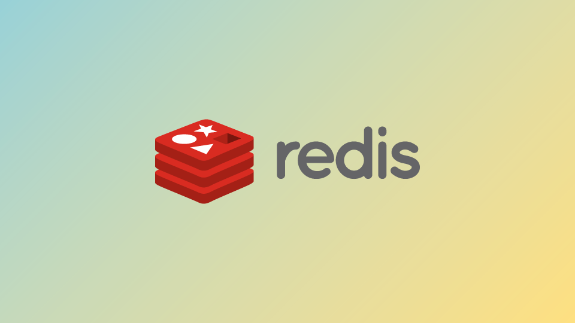

# redis入门知识第1篇-redis简介

## 一、概述

服务器软件项目的瓶颈的一般由于海量用户和高并发引起，其中罪魁祸首是关系型数据库。原因是关系型数据库存在以下的缺点：

- 性能瓶颈：磁盘 IO 性能低下

- 扩展瓶颈：数据关系复杂，扩展性差，不便与大规模集群

想要解决这个磁盘IO的瓶颈，于是产生一个解决思路：降低磁盘 IO，越低越好，即用内存存储。去除数据关系，越简单越好，不存储数据之间的关系，仅存数据。这就是我们说的 Nosql

## 二、什么是NoSQL？

### 2.1 概念

NoSQL: Not Only SQL（泛指非关系型数据库），作为关系型数据库的补充。NoSQL 的作用是：应对基于海量用户和海量数据的前提下的数据处理问题。其具有以下特点：

- 可扩容，可扩充
- 大量数据下高性能

- 灵活的数据模型
- 高可用

### 2.2 常见的 NoSQL

- Redis
- memcache
- HBase
- MongoDB

### 2.3 电商解决方法

（1）商品基本信息：名称、价格、厂商，这类结构化信息一般存在关系型数据库中，如MySQL

（2）商品附加信息：描述、详情、评论，这类文档信息一般用 MongoDB

（3）图片信息：静态文件用分布式文件系统

（4）搜索关键字：ElasticSearch、Lucence、solr

（5）热点信息（高频、波段性的信息）：用高性能的内存数据库 redis、memcache、tair

## 三、Redis的概念

### 3.1 概念

Redis(Remote Dictionary Server)是用 C 语言开发的一个开源的高性能键值对（key-value）数据库。是目前最热门的用于数据缓存，以实现高并发的工具。

### 3.2 特征

（1）. 数据之间没有必然的关联关系

（2）. 内部采用单线程机制进行

（3）. 高性能。官方测试数据，50 个并发执行 100000 个请求，读的速度是 110000 次/s，写的速度是 81000 次/s。

（4）. 数据类型的支持

- 字符串类型 string
- 列表类型 list
- 散列类型 hash
- 集合类型 set
- 有序集合类型 sorted_set

（5）. 数据持久化。可以进行数据灾难恢复

### 3.3. redis 的应用

- 数据热点的加速查询（主要场景），如热点商品、热点新闻、热点咨询、热点推广等高 访问量信息
- 任务队列，如秒杀、抢购、购票排队
- 及时信息查询，如各类排行、各类网站的访问统计、公交到站信息、在线人数信息（聊天室、网站）、设备信号等
- 实效性信息的控制，如验证码控制、投票控制
- 分布式数据共享，如分布式集群架构中的 session 分离
- 消息队列
- 分布式锁

## 四、总结

在这篇文章中，我们了解了**NoSQL**的概念，同时介绍了**Redis**相关概念以及应用场景，在后续的文章中，我们继续探讨**Redis**的知识。
