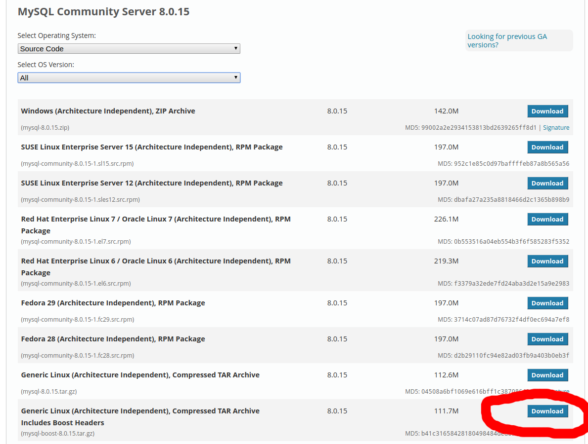

# LAMP环境搭建之从源码安装MySQL

## 一、工具

- Debian 9.0 Server
- mysql-8.0.16.tar.gz 源码包

> MySQL最新源代码下载地址：[https://dev.mysql.com/downloads/mysql/](https://dev.mysql.com/downloads/mysql/)

我们直接下载最新版MySQL的源代码，如图所示


## 二、安装步骤

1. 安装编译环境
2. 配置编译参数
3. 编译与安装
4. 使用MySQL

## 三、安装过程

以下操作均在root用户模式下进行，“#”之后为注释内容

### 3.1 安装编译环境

- cmake编译工具

早在MySQL 5.\* 的时候，MySQL源码就开始使用`cmake`进行编译了，在安装源码之前我们先安装上`cmake`

```shell
apt install cmake
```

- ncurses、build-essential、libssl-dev、pkg-config

这些库是必须的，安装命令如下

```shell
apt install -y libncurses-dev build-essential libssl-dev pkg-config
```

- Boost C++

我在写这个文档的时候，MySQL的最新版本是8.0.16，需要依赖boost_1_69_0，所以我们需要进入boost官网直接下载压缩包，然后解压到系统目录中，在编译过过程中指定boost目录即可。以下链接作为参考

官网链接：[https://www.boost.org/](https://www.boost.org/)

boost_1_69_0下载链接：[https://dl.bintray.com/boostorg/release/1.69.0/source/boost_1_69_0.tar.gz](https://dl.bintray.com/boostorg/release/1.69.0/source/boost_1_69_0.tar.gz)

下载boost_1_68_0压缩包之后，我们直接将其解压到系统目录中，如下命令：

```shell
# 解压安装包
tar -zxvf boost_1_69_0.tar.gz
# 把boost文件目录移动到系统目录
mv boost_1_69_0 /usr/local/
```

### 3.2 配置编译参数

根据官网文档，我们在编译MySQL 8.0.16源码之前。执行以下命令，添加名为“mysql”的用户

```shell
# 添加用户组
groupadd mysql
# 添加用户
useradd -r -g mysql -s /bin/false mysql
```

解压源码包

```shell
# 解压源码包
tar -zxvf mysql-8.0.16.tar.gz
# 进入源码目录
cd mysql-8.0.16
# 新建一个用于保存编译中间文件的临时目录
mkdir bld
# 进入临时目录
cd bld
```

配置编译参数

```shell
cmake .. -DCMAKE_INSTALL_PREFIX=/usr/local/mysql -DWITH_BOOST=/usr/local/boost_1_69_0/
```

cmake命令执行之后会生成编译配置文件，在执行过程中，也会检测本地的依赖是否满足，以上命令使用的关键参数如下：

`..`：两个点代表编译上一级目录，因为bld临时目录是在源码目录之下的一个目录，而我们需要指向源码目录

`-DCMAKE_INSTALL_PREFIX`：指定mysql的安装位置，如果这个参数不指定的话，默认就是/usr/local/mysql

`-DWITH_BOOST`：指定boost_1_69_0的安装目录

如果配置没有错误，你会看到“Configuring done”等的提示，如下图，你可执行下一步的编译与安装。


如果出错了，你需要分析错误提示，同时需要删除当前`bld`临时目录下面cmake命令执行之后产生的所有文件，细心一点，根据文档教程重来一遍。

### 3.3 编译与安装

编译：

```shell
make
```

安装

```shell
make install
```

安装时间比较长，可能需要等好几十分钟，主要取决与你电脑的速度。

安装完成之后，根据官方文档，我们需要执行以下命令

```shell
# 进入安装目录
cd /usr/local/mysql
# 创建目录
mkdir mysql-files
# 修改目录所有者和所属组为mysql
chown mysql:mysql mysql-files
# 修改目录权限
chmod 750 mysql-files
# 初始化mysql,此时会为'root'@'localhost'用户生成一个临时密码，我们需要记住
bin/mysqld --initialize --user=mysql
# 执行ssl_rsa初始化命令
bin/mysql_ssl_rsa_setup
```

将服务脚本复制到系统中，当然了，这是可选的，命令如下

```shell
cp support-files/mysql.server /etc/init.d/mysql.server
```

完成以上操作，就可以开启服务了，命令如下

```shell
bin/mysqld_safe --user=mysql &
```

登录到MySQL数据库

```shell
bin/mysql -u root -p
```

连接数据库之后，使用以下命令修改密码

```sql
ALTER USER 'root'@'localhost' IDENTIFIED BY '你的密码';
```

### 四、使用MySQL

在MySQL 8.0系列中，默认的身份验证插件已将 mysql_native_password更改为 caching_sha2_password，并且在 'root'@'localhost'管理帐户中默认使用caching_sha2_password验证方式。

在写这篇文章的时候，很多开源程序如wordpress、typecho是不可以直接连接的，所以使用MySQL8.0数据库，你可以更改默认验证方式，你还可以新建一个专门用于你项目开发的一个数据库账号，并使用mysql_native_password验证方式。

以下方法可更改root用户的验证方式

```sql
ALTER USER 'root'@'localhost' IDENTIFIED WITH mysql_native_password BY '密码';
```

默认情况下MySQL 8.0使用第三方工具默认也是不能连接的，如果有需要，你需要更改一下密码的加密方式

```sql
ALTER USER 'root'@'localhost' IDENTIFIED BY '密码' PASSWORD EXPIRE NEVER;
```

如果你想同时更改密码验证方式和加密方式，可以直接使用以下命令

```sql
ALTER USER 'root'@'localhost' IDENTIFIED WITH mysql_native_password BY '密码' PASSWORD EXPIRE NEVER;
```

到这里就算安装成功了，感谢你的阅读

> 此博客参考MySQL官方文档[https://dev.mysql.com/doc/](https://dev.mysql.com/doc/)
