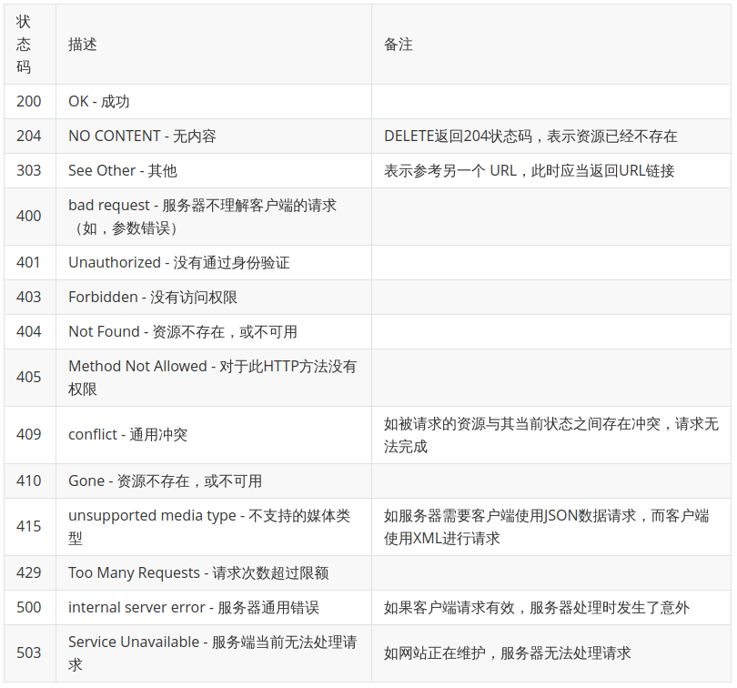
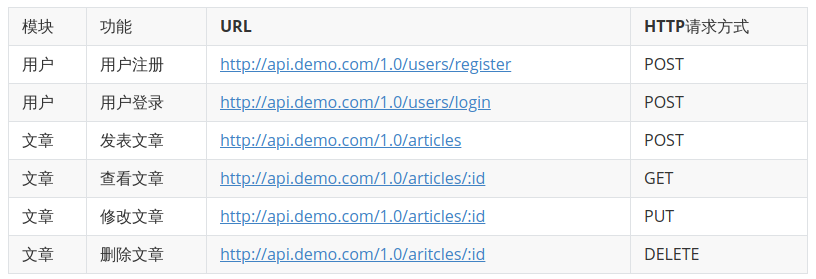

# RESTful架构API风格与相关规范

## 一、概述

RESTful架构，就是目前最流行的一种互联网软件架构。REST是Representational State Transfer词组的简写，即“表现层状态转化”。代表（互联网资源）表现层状态转化。

REST是Roy Fielding博士在2000年在其论文中第一个提到的，因为他是互联网行业内一个重要的人物（HTTP 1.0/1.1协议的主要设计者、Apache开源基金会的第一任主席），所以引起了人们的关注，并且对互联网产生了深远的影响。

RESTful不是一个标准，但是一种规范。现在很多软件使用使用前后端分离的应用结构，它结构清晰、符合标准、易于理解、扩展方便。前端（H5、Android、iPhone、小程序）往往通过调用API的方式与后端进行数据交换。那么，符合RESTful规范的软件架构的API我们可称之为RESTful APl。如微博开放API和Github开放API就严格遵循了RESTful规范。

以上是对RESTful架构的概述，在本文中，我将使用自己的理解完整的表述RESTful的规范，以及如何设计符合RESTful规范的API。实际上，在对计算机技术的理解中，一百个人可能会有一百种理解方式，尽管见仁见智，但我们的目的都是把技术当作工具，去实现我们的程序功能。如果在本文中的描述有所错误，或您有所不解，欢迎留言评论！

本文将分为将分为三个内容，简要探讨RESTful的API规范

- 理解 RESTful

- RESTful API架构规范

- RESTful API 设计示例

## 二、理解RESTful

要理解RESTful，我们需要从每一个词开始理解。Roy Fielding将他对互联网软件的架构原则命名为REST，即Representational State Transfer的缩写，代表（资源）表现层状态转化。如果一个软件架构符合REST原则，就称它为RESTful架构。

### 2.1 资源（Resources）

我们在互联网软件开发中，我们所说的“资源”是指在互联网中某一个节点的具体信息，如一段文本、一张图片、一个视频、一个压缩包、一个程序安装包等等。在互联网中，我们可以使用URI（统一资源定位符）来表示每一个具体的资源，因此，每一个互联网资源都一个独一无二的URI地址。

### 2.2 表现层（Representational）

“资源”是一种信息的实体，实际上，资源有很多表现形成，如一段文本，我们可以使用普通的txt格式来表示，也可以用JSON格式来表示，还可以使用XML格式来表示。“资源”的具体表现形式我们就叫做表现层。在HTTP协议中，规定了头信息中的Content-Type字段来描述具体的资源表现形式。如“Content-Type: text/html”表示为html格式的文本数据，而“Content-Type: text/json”表示为JSON格式的文本数据。

### 2.3 状态转化（State Transfer）

HTTP是一种无状态的网络协议，如果客户端要操作服务器，必须通过一种手段通知服务器进行“状态转化”，而这种状态改变建立在“表现层”之上，这就是“表现层状态转化”。在HTTP协议中，客户端通过发送相应的请求告知服务器实现某种状态的改变。客户端使用GET、POST、PUT、DELETE4个表示操作方式的动词对服务端资源进行操作。

综上所述，我们可以总结一下RESTful的特点：

- 每个互联网资源都有一个唯一的URI地址
- 通过操作资源的表现形式来操作资源
- 一般情况下使用JSON格式来表示具体的数据
- 使用HTTP协议进行客户端与服务端之间的交互，从客户端到服务端的每个请求都必须包含理解请求所必需的信息
- 客户端使用GET、POST、PUT、DELETE 4个表示操作方式的动词对服务端资源进行“状态”操作

## 三、RESTful API架构规范

REST并没有明确的设计标准，可以说RESTful是一种设计风格的规范化。在RESTful API设计中，不同的组织可能还存在不同的设计风格规范，但是整体上RESTful的风格规范是一致的。

也正是因为有了一致的风格规范，让读API的人更好地理解API，甚至不用阅读文档，就知道API要实现的某个资源的某种“状态转化”。根据Github开放API或者微博开放API的设计风格。下面是我总结的RESTful API的相关风格规范，今后我将使用此规范进行API开发。

### 3.1 协议

客户端与服务器之间使用HTTP或者HTTPS协议进行通信。

### 3.2 域名

应当尽量将API程序部署到专有的域名之下，如：

```text
https://api.demo.com
```

如果API比较简单，或者不考虑进行扩展，应当放在项目的子模块中，如：

```text
https://demo.com/api/
```

### 3.3 API版本

应当将API版本放在URL中，如微博开放API就将版本号放在URL中：

```text
http://api.weibo.com/2/
```

如果我们把版本号理解成资源的不同表述形式的话，API版本应放在HTTP请求头Accept字段中，如github中的开放API

```ini
Accept: application/vnd.github.v3
```

可能github考虑很多因素，所以把请求的API版本放到HTTP请求头里了。实际上，如果我们想要快速的开发一个API程序，使用第一种形式会更加直观与方便。

### 3.4 路径

对于不同的资源，都有一个唯一的URL地址，每一个URL地址代表一种资源，所以网址中应当是名称，不能是动词，而且名词应当与数据库表名对应。一般来说，数据库中保存的是数据集合，所以URL中对应的资源应当是名词复数。

如Github开放API中，列出一个组织的项目集合

```text
https://api.github.com/orgs/:org/projects
```

在上面URL中，orgs代表组织集合，而:org代表集体的组织名，projects代表具体的资源

### 3.5 HTTP动词

对于资源的某种具体操作类型，需要客户端发送不同的HTTP动作来完成。
常用的五个HTTP动词已经对应操作如下：

- GET（Retrieve）：从服务器取出资源（一项或多项）；
- POST（CREATE）：在服务器新建一个资源；
- PUT（UPDATE）：在服务器更新资源（客户端提供改变后的完整资源）；
- PATCH（UPDATE）：在服务器更新资源（客户端提供改变的属性）；
- DELETE（DELETE）：从服务器删除资源。

实际上，最常用的额HTTP动词原先只有4个，即GET、POST、PUT、DELETE，PATCH方法是新引入的，是对PUT方法的补充，用来对已知资源进行局部更新。

有时候，只需要修改一个属性，开发者通常(为图省事)把一个包含了修改后完整信息传给后端，做完整更新。但实际上如果需要考虑性能优化，是有必要做局部更新的。

### 3.6 过滤

在获取服务器资源的时候，大部分情况是需要进行过滤的，而不是获取数据库中的完整集合。这时候需要设置过滤条件，我们可以将过滤条件作为参数拼接到URL中。如下：

```text
?limit=10  # 指定获取10条信息集合
?page=1&limit=10  # 指定每页10条信息，获取第1页信息集合
?limit=10&deleted=true  # 获取数据库中已经标志为删除的10条信息集合
```

### 3.7 返回

使用相应的HTTP状态码，将结果告知客户端，以下是常用的HTTP状态码以及状态描述：



- 正常：如果正常返回数据，应当使用msg或者其他关键字作为键名返回给客户端，如下

```json
{
"data":[
    "user_id":1,
    "name":"张三",
    "token":"csdcnsdvndsijudsao",
],
"message":"OK",
"code":200
}
```

- 错误：如果发生错误，应当使用error作为错误信息的键名返回给客户端

```json
{
"error":"Unauthorized",
"code":401
}
```

针对不同操作，服务器向用户返回的结果应该符合以下规范：

- GET /collection：返回资源对象的列表（数组）
- GET /collection/resource：返回单个资源对象
- POST /collection：返回新生成的资源对象
- PUT /collection/resource：返回完整的资源对象
- PATCH /collection/resource：返回完整的资源对象
- DELETE /collection/resource：返回一个空文档

### 3.8 Hypermedia API

RESTful API最好做到Hypermedia，即超媒体，在返回结果中提供链接，连向其他API方法或者一些文档，使得用户不查文档，也知道下一步应该做什么。如Github就做到了Hypermedia，使用GET方式请求 <https://api.github.com> ，会返回一系列的链接地点：

```json5
{
  "current_user_url": "https://api.github.com/user",
  "current_user_authorizations_html_url": "https://github.com/settings/connections/applications{/client_id}",
  "authorizations_url": "https://api.github.com/authorizations",
  "code_search_url": "https://api.github.com/search/code?q={query}{&page,per_page,sort,order}",
  "commit_search_url": "https://api.github.com/search/commits?q={query}{&page,per_page,sort,order}",
.....
```

## 四、RESTful API设计示例

RESTful API风格主要体现在URL中，接下来，我们通过一个示例，来完成RESful API的URL制定。假设我们要开发一个简单的博客系统，要给H5、Android、iPhone、小程序提供一套统一的接口。那么预设功能与对应URL已经请求方式如下：



>本文为作者原创文章，禁止转载，原作者：[https://phy.xyz](https://phy.xyz)
>
