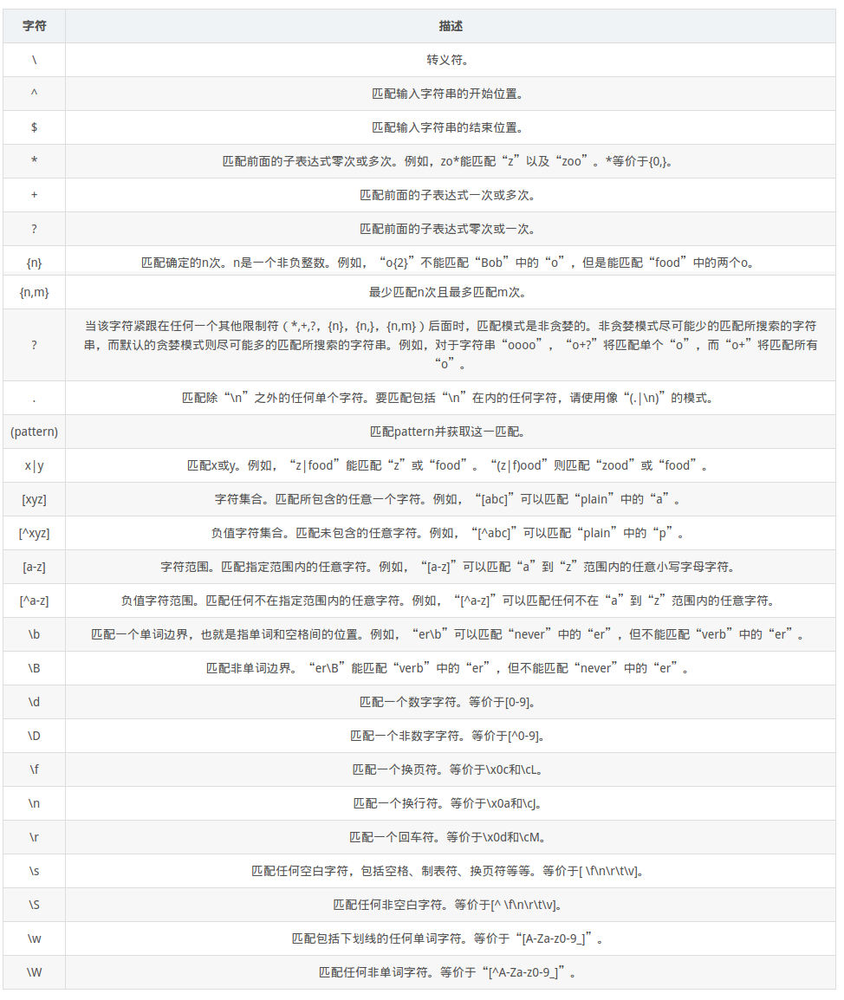

# 正则表达式的常用语法规则

## 什么是正则表达式？

其实正则表达式就是描述一类字符串的特征，通过这个特征与特定函数配合使用，对其他的字符串进行匹配、查找、替换、分割等操作的逻辑公式！

## 我们什么时候使用正则表达式呢？

在编程中，不是所有的字符操作都使用正则表达式，只有当我们遇到复杂字符串的时候，才会用到正则表达式。

## 正则表达式的语法规则

正则表达式秒素了一类字符串的特征，通过这个特征与特定的函数配合，对其他的字符串进行匹配、查找、替换以及分割操作！

这类字符串的特征是有一个或者多个

- 1.普通字符（比如a到z）、

- 2.元字符（有特殊功能的字符比如*、+、?），

正则表达式正是由普通字符和元字符组成的一个字符串，例如'/a/'，a就是普通字符，/是定界符（表示正则表达式的开始或结束）。下面是正式表达式中常见的符号

## 中文正则验证

- 1.js

匹配中文字符的正则表达式： \[\u4e00-\u9fa5\]
匹配双字节字符(包括汉字在内)：\[^\x00-\xff\]

- 2.PHP

/^\[\x{4e00}-\x{9fa5}\]+$/u
其中"\x{4e00}-\x{9fa5}"代表汉字验证。"/u"代表unicode(utf-8)匹配。
在php中，不支持\[\u4e00-\u9fa5\]匹配汉字，而是用\x表示十六进制数据，然而php中用"\[\x4e00-\x9fa5\]"的写法也是错的，必须用{}把它包起来才行。此外，由于编码关系，需要用到"/u"声明编码格式.
