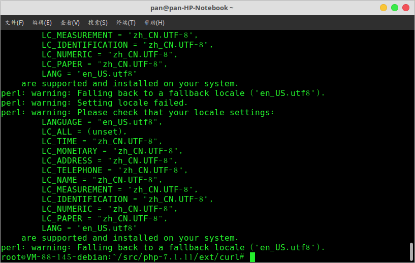

# 解决执行phpize报错：perl: warning: Falling back to a fallback locale ("en_US.utf8").

今天在服务器上安装php的curl扩展，但是在运行phpize命令时遇到"perl: warning: Falling back to a fallback locale ("en_US.utf8")."错误提示，如图：



根据提示，估计是系统语言库缺失的问题，于是安装i18n(internationalization:国际化)语言包：如下

```shell
apt install locales-all
```

很幸运，再次运行phpize命令，成功解决问题
