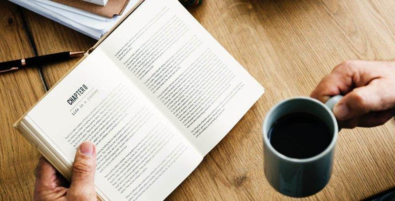

# 在大学里，最基本的要做什么？

> 撰写时间：2018-09-10 14:50，更新时间：2022-07-12

这篇文章写给刚刚步入大学生活的小萌新们。

这几天校园里看到大一新生在军训，那股热血沸腾的劲让我想起了以前入学的时候，那时的记忆历历在目。但与此同时又感觉到，自己与班上很多同学还没来得及说过几次话呢，就要面临毕业了。

时间是过得很快的，在这瞬息万变的世界里，你根本不知道明天会发生什么。希望刚刚入学的你做好自己的大学生活计划，少一些迷茫，希望你在将来面临抉择的时候，能够多一些选择。以下普及一些大学里的常识，也给你一些建议。

## 一、完成自己的学业任务

- 1.1 毕业证与学位证的重要性

说的现实一些，我们每个进入大学的人的一个重要目标就是拿到毕业证和学位证。你可以说这两个证没有什么含金量，但是这两个证却是我们进入社会的通行证，没有它我们甚至是寸步难行。没有谁希望自己辛苦上了四年大学，最后却得不到一个证书。所以告诫大家，在大学里，一定要认真完成自己的课程任务，不要最后留下遗憾。

- 1.2 如果被调剂到了自己不喜欢的专业该怎么办？

首先，你需要从这种压抑的困境里走出来，每年有很多人被调剂到了自己不喜欢的专业，但是既然来了，你应该安心下来，用心完成自己的该完成的任务，或者说解决这个问题。

很多大学都设在大一下学期的时候有一次转专业的机会，但是你的成绩要达到合格你喜欢的专业才会接受你，这个成绩一般表现在你在大一上学期的课程的成绩，包括英语、高等数学等，除此，你还要通过面试，如果确实对你的现在的专业不感兴趣，你可以拼一拼，大一上学期好好努力，通过自己的努力去换专业。

还有一个选择就是，你要想办法喜欢上你现在的专业。即使做不到百分喜欢，你也要完成本专业相应的课程学习与考试，我们最终的目的都是要顺利拿到学位证，不说其他的，这确实是我们在大学里最重要的一个任务。

- 1.3 制定计划完成自己的学习任务

我们在大学里，需要修满一定学分的课程，包括必修和选修。简单的说，你的每一门课程需要达到合格以上，也就是说60分以上是最低的要求标准。

在大学里，你的必修课包括公共必修和专业必修，公共必修又包括数学、外语、政治三大类，然后就是你的专业必修了。当然，选修课你也要重视。每一门课程如果能够获得优秀的成绩最好，但是最基本的，你需要通过每一门考试，这是最低的要求。因此，制定好自己的学习计划，不要落下任何课程。

## 二、提高自己的语言能力

- 2.1 交际能力

怎样快速适应新环境，怎样表达自己的观点，怎样与陌生人交流。这些都是我们需要掌握的必备能力，这些能力都需要从现实生活中来提高自己。因此在大学里，我们可以多参加一些有意义的活动，比如说参加辩论赛、交朋友等，从中提高自己。

- 2.2 英语阅读能力

每个人应该好好学习英语，提高自己的英语阅读能力，你就上升了一个台阶。在今后的学习生活中，也许你需要的很多文档资料都来自国外网站、英文书籍，虽然说我们可以找到很多翻译版本，但是绝对失去了原有的那种语意。不要因为不喜欢英语你就不去考英语四级或者英语六级，你需要提高自己，拼一拼，除了提高自己的能力，在今后的工作中也会更加得心应手。

- 2.3 表达与写作能力

表达与写作能力是你必须要有的，不管你学的是什么专业，表达与写作是你应必备的技能。不要在以后写稿子的时候都要百度一下，不要一到公众面前什么都讲不出来。那么从大一开始，你就需要好好锻炼自己，与人交流可以提高自己的表达能力，阅读可以提高自己的写作能力。在生活中要学会倾听别人、养成读书的好习惯，这是你在大学生活中该做的。

## 三、追求健康的大学生活

- 3.1 要规划好自己的时间

在大学里，一定要好好安排自己的时间。在高中的时候，大家的目标都是考大学，但是在大学里，每个人都有不同的目标与计划。所以很多时候你是自己做自己的事，身边没有那么多和自己同路的朋友。甚至可以说，高中是一群人的高中，但是大学，是你一个人的大学。你对未来有了更详细的计划，所以在接下来的一段时间里，你也许会很孤独，这条路需要你自己走。

一定要爱护自己，无论什么何时何地，健康是最重要的。拥有了健康你才拥有追求目标的能力。不要经常通宵熬夜，一定要经常锻炼身体。

什么时候该起床、什么时候该休息、什么该学习、什么时候需要锻炼身体，你应该好好规划这些时间。

- 3.2 不要沉迷玩乐

不要把手机当成你的电视机、不要把电脑变成你的游戏机。如果课余时间都拿来投入到网剧和游戏中，那最后我们什么都得不到。娱乐一定要要有度，每个人对自己了未来、今后的另一半，还有自己的家人，有一份不可推脱的责任。我们该花更多的时间去完成自己现在该做的事。

- 3.3 学习一些实用的技能

除了完成必须的课程，我们还需要学习一些在今后工作中的技能。自己的长处是什么？喜欢什么？学习办公软件、学习英语、学习剪辑、学习编程等等，要知道自己真正需要的是什么。在今后的工作中，也许你从事的职业与你现在的专业完全无关，现在多学一些技能，今后就多一些竞争力。这些都是你应该争取的。

## 四、一定要积极向上

不管在大学里遇到什么困难，千万不要灰心，所有的问题都有它的解决办法。遇到困难时静下心来，在不破坏最大利益的前提下，寻求最佳解决办法。在生活中，有朋友是你幸运的事，多关心你身边的朋友。遇到任何事，不要冲动，一定要考虑别人的感受，不该做的的事就不要去做。

在大学里，乐观对待身边的人和事；明确自己的目标，并且通过自己的努力去索取。高考结束了，不是你学习知识的终点，而是你迈向一个新阶段的起点，好好想一想，你真正需要的是什么？你现在仍然需要保持刻苦与努力......

加油！祝你好运！

原文作者：[极客开发者](https://blog.jkdev.cn)
