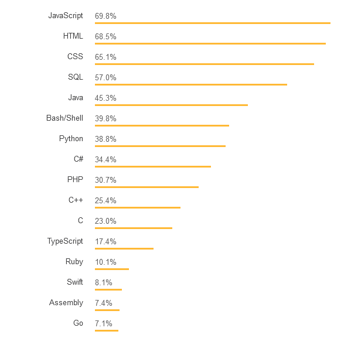

# 如何自学编程？-怎样选择入门语言？

上次分享了一篇文章：[《如何自学编程？》](https://blog.jkdev.cn/index.php/archives/122/)，从初学者的角度给大家介绍了一些基本的概念和一些术语。

今天将继续给大家分享一些知识和一些建议。如果你以一个初学者的身份选择了这条路，那你该选择什么编程语言作为入门学习语言？

你可能想成为一个APP开发工程师；你可能想成为一个Web前端开发工程师或者后端开发工程师；你也可能想成为AI（人工智能）工程师或者大数据工程师。在你实现愿望之前，你必须掌握一门编程语言基础，并且有能力灵活运用这门编程语言来完成你要完成的任务，还要不断地学习来提高自己的能力。我们现在以找求职为目的，分析一下应该选择什么编程语言作为入门学习语言，才使自己能尽快地成长。

## 先看看编程语言的活跃度

我们先来看看国外网友分享的在某个时间段内，各大编程语言的受欢迎程度：

为什么JavaScript、HTML、CSS分别排名前三？我们也可想而知，在互联网时代，最基础的互联网数据是以网页的形式给用户展示的。每个网页最基础的技术就是使用这三种语言来实现的，而现在每天会有大大小小的、大量的网站被上线、每个网站的数据随着时间的改变也会不断地增加。由于这些原因，就能最好解释为什么JavaScript、HTML、CSS在某个时间段内能成为使用最广的编程语言了。其次，应用程序与数据库的交互就是通过SQL语言来完成，我们也能预想到SQL语言会占有很高的地位。

## 活跃度高不代表开发人员需求高

虽然从编程语言排行来看，JavaScript/CSS/HTML占有非常高的地位。但是也不能代表目前市场对开发相关人员需要最高。如果我们是以求职为目的而自学编程，该如何选择一门编程语言作为自己入门学习语言的并作为自己的发展方向，那么最好要综合考虑自己的兴趣和市场的发展前景。
其实，我们的长远的目标是至少精通一门语言，但也要了解其他语言。

## 明确自己的职业目标，选择对应的编程语言

每一种编程语言的存在都有它自己存在的意义，我们学习编程语言的目的就是能高效地使用它们来帮我们完成相应的任务。
假如我们在开发一个软件项目的时候需要选择一门语言作为程序的后端语言，就可以从Java、Python、Golang、PHP、C++、C#中做选择。但不同的编程语言有不同的特性，我们通常会根据项目的不同需求来选择不同的语言，那么只有掌握了这些语言才你自己才能了解对你自己来说他们的一些优缺点，也才能更好的使用他们。

假如你需要快速开发一个网站，选择PHP不错；假如你希望基于开源框架，又要提高一下程序的性能，选择Java和Python也可以；如果你想要程序做到十分稳定，可以选择C++，不过C++的开发成本可能会更高。不同的项目往往有不同需求，那么我们首先至少要掌握一门技术。
作为初学者，你要知道自己的目标和自己喜欢的方向，然后选择自己入门学习语言，以下是一些建议：

- Android APP方向

学Java的同时学习Android API，掌握到一定程度之后然后继续学习Kotlin；

- Web前端方向

首先学JavaScript/CSS/HTML最基础的知识，至少你要会用它们来完成一个网页代码的编写。然后就是学习一些框架，能帮你快速完成开发，如jQuery库、BootStrap响应式UI组件；还有大名鼎鼎的Angular 和近几年比较火的Vue.js；近几年很多公司也增加对前端工程师的技能要求，需要掌握Node.js后端语言，不过它基于JavaScript，有了JavaScript基础都很容易学习。

- 后端方向

作为初学者，你可以选择Java、PHP、Python任何一门语言作为自己学习的后端语言。他们也都是拥有自己的特性，擅长不同的领域，如果说要快速开发一个用户交互的小网站，可以考虑从PHP开始学习。

## 选择什么语言、从哪个方向最好入门？

这里的答案是：前端开发。前端开发方向对大多数人来说应该是最好入门的，因为学习门槛低，代码也容易理解。其实后端工程师都是要掌握前段的基础，只是他们可以不擅长前端开发而已。学期前端的基础要求并不高，你只需要会电脑的基本操作和一些简单的英语单词，对学习来说困难是不大的，但是你想要精通却不是容易的事。

一个成功的网站，友好的界面和人性化的交互方式必定是一个重要的部分。如果你选择前端方向，那么你最终的应该具备的能力是：在你脑海中想像程序界面长什么样子，有哪些动画，你都能快速地使用代码来实现。

初学的时候，先从最基本的HTML标签开始，知道他们的用处，其次要学会使用CSS语言来定义HTML网页的样式，最后要会使用JavaScript来操纵HTML标签，改变网站显示内容。所以学习路线很清晰，HTML -> CSS ->JavaScript ，最后要学习常用的框架。

## 哪个开发方向容易找到工作？

就目前整个行业来说，程序员并不像以前那么好找工作，因为这几年编程人员越来越多。但是你只要有能力就不怕找不找工作的，因为不断地出现创业公司提供很多就业机会，况且，虽然有很多程序员，但是却有很多公司招不到高级工程师，所以有能力必定有机遇。那么为了求职，我们从哪个方面入门学习对自己最有利？以下列出几个方向

- 前端工程师

你需要学习最基本的前端知识，掌握一个前端网页代码的编写任务，同时，要会使用各种热门的前端框架如jQuery、Angular、Vue.js，最好还要掌握微信小程序开发。

- PHP工程师

PHP可能是最适合快速开发网站的一门服务器语言了，现在从很多网站都能找到PHP的身影，所以市场上有很多PHP工程师的岗位。

- Java后端工程师

Java很适合作为前后端分离程序中的后端语言，因为它是一门完全面向对象的编译类型语言，很容易升级与维护，并且Java有很多开源框架，可以说Java是非常热门的编程语言，很多大公司都是使用Java来处理重要的业务。

- Python后端工程师

Python代码有一个特点是比较简洁，Python本身封装了很多库，有时候实现一个功能只要一行代码就搞定，特别在算法方面表现出色；在Web开发上，也有很多公司使用Python来作为他们的后端语言。

如果你注意看招聘网站的话，这几个职位应该是一直在招人。我们可以用半年或者一年的时间，从零开始学习，就可以掌握对一个工作岗位的开发基础。

## 推荐使用Java作为入门学习语言

先说说我自己的经历，我大学开始接触编程。由于自己理解能力不是很强，所以当时学习C语言比较费劲。第一学期就有C语言课程，当时挺有热情的，不过课外时间没花多少时间，主要是当时的课程任务太重了，几乎满课，周目还要写很多作业。但是一个学期过去了我都不知到它到底能做什么，当时始终难以理解i++和++i的意思。我同学也一样，很多人都表示头疼。

我建议，如果你不是计算机相关专业的，况且想要通过自学走编程这条路，尽量不要以C语言作为入门学习语言，它可能会让你失去信心。选择你喜欢的、况且容易找到工作的一门技术，然后学习对应的编程语言，这应该是最明智的选择。

如果没有任何基础，你也有充沛的时间，学习什么最好？
如果你要走编程这条道路，将来必定会接触很多编程语言，那么选择什么语言能快速提高自己的技能？我十分推荐Java，有以下几个原因：

- Java是一门纯面向对象编程语言

学习Java基础，你能掌握面向对象编程的基础，虽然还有其他编程语言也有面向对象特性，但是Java是纯面向对象的，使用Java你能体会到面向对象编程的整个过程；

- Java语法十分严格
Java是一门编译型语言，源代码通过编译之后生成可执行文件才能运行。编译型的语言语法要求十分严格，容不下一点语法错误，所以学习Java你会习惯性地注重一些程序的细节。等你掌握了Java，再来学习C/C++的时候，你会发现十分容易。

- Java拥有丰富的开源库

有强大的开源社区支持，Java拥有非常多的成熟的开源库，Java也是目前后端开发中使用最多的语言，所以你在学习的时候如果遇到任何问题，完全可以从网上找到解决办法，对自己的自学之路很有帮助。

以上就是这次给大家分享的内容，当然都是自己的观点。在真正选择自己学习方向的时候你需要综合考虑自身的情况再做出最好的选择。最重要的是，学一门技术，你要真正的会使用它，能用它独立完成相应的项目，这才是真正的学到知识。

***
文章原创首发自微信订阅号：**极客开发者**，禁止转载
