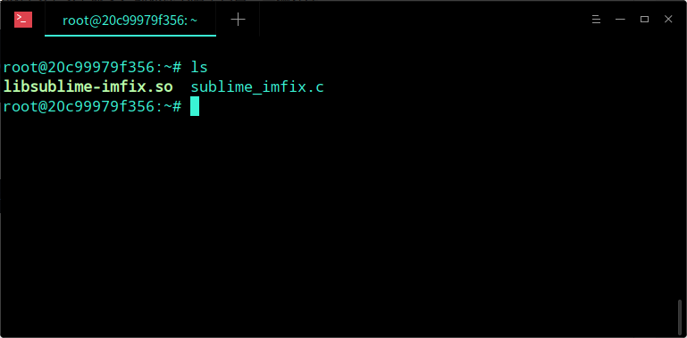

# Linux下解决Sublime Text 3无法输入中文的方法

## 一.环境

- Ubuntu 16.04 (Debian系列：LinuxMint 、Deepin等也一样)
- 中文输入法 (搜狗输入法或者系统自带的中文输入法)
- Sublime text 3

## 二.准备工作

因为我们需要编译一段代码，首先执行以下以下命令，确保你电脑了包含基础的编译环境

```shell
sudo apt instal gcc
sudo apt install pkg-config
sudo apt install gtk+2.0
```

除此之外，安装一下gedit编辑器，当然，如果你使用其他的编辑器也可以

```shell
sudo apt install gedit
```

## 三.解决过程

### 3.1、编译源代码

新建sublime_imfix.c文件，复制以下代码

```c
#include <gtk/gtkimcontext.h>

void gtk_im_context_set_client_window (GtkIMContext *context,

         GdkWindow    *window)

{

 GtkIMContextClass *klass;

 g_return_if_fail (GTK_IS_IM_CONTEXT (context));

 klass = GTK_IM_CONTEXT_GET_CLASS (context);

 if (klass->set_client_window)

   klass->set_client_window (context, window);

 g_object_set_data(G_OBJECT(context),"window",window);

 if(!GDK_IS_WINDOW (window))

   return;

 int width = gdk_window_get_width(window);

 int height = gdk_window_get_height(window);

 if(width != 0 && height !=0)

   gtk_im_context_focus_in(context);

}
```

使用命令编译源代码

```shell
gcc -shared -o libsublime-imfix.so sublime_imfix.c  `pkg-config --libs --cflags gtk+-2.0` -fPIC
```

成功编译之后会看到一个so文件，如图所示


### 3.2、再把so文件复制到sublime所在目录

```shell
sudo mv libsublime-imfix.so /opt/sublime_text/
```

### 3.3、执行下面命令，使用gedit打开配置文件并修改

- (1) 为了在命令中执行 subl 将可以使用中文输入，修改/usr/bin/subl

```shell
sudo gedit /usr/bin/subl
```

将

```shell
#!/bin/sh
exec /opt/sublime_text/sublime_text "$@"
```

修改为

```shell
#!/bin/sh
LD_PRELOAD=/opt/sublime_text/libsublime-imfix.so exec /opt/sublime_text/sublime_text "$@"
```

- (2) 为了使用鼠标右键打开文件时能够使用中文输入，需要修改文件sublime_text.desktop

打开文件

```shell
sudo gedit /usr/share/applications/sublime_text.desktop
```

将[Desktop Entry]中的字符串

```shell
Exec=/opt/sublime_text/sublime_text %F
```

修改为

```shell
Exec=bash -c "LD_PRELOAD=/opt/sublime_text/libsublime-imfix.so exec /opt/sublime_text/sublime_text %F"
```

将[Desktop Action Window]中的字符串

```shell
Exec=/opt/sublime_text/sublime_text -n
```

修改为

```shell
Exec=bash -c "LD_PRELOAD=/opt/sublime_text/libsublime-imfix.so exec /opt/sublime_text/sublime_text -n"
```

将[Desktop Action Document]中的字符串

```shell
Exec=/opt/sublime_text/sublime_text --command new_file
```

修改为

```shell
Exec=bash -c "LD_PRELOAD=/opt/sublime_text/libsublime-imfix.so exec /opt/sublime_text/sublime_text --command new_file"
```

修改完成之后就可以使用中文输入了
