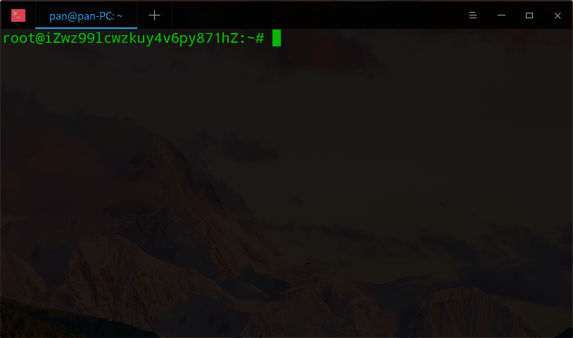

# 怎样阻止Linux执行rm -rf /*命令

## 一、概述

自己在`Debian 9.9`上测试成功，请结合您操作系统的环境，谨慎操作，在进行测试时候尽量先使用一个临时目录，若由于你的不正确操作造成的后果与本人无关

众所周知，Linux中的`rm -rf /*`命令是一条灾难性的命令，因此有的运维人员想一些办法来禁止这条命令的执行，今天演示一个简单的工具。该工具可以有效阻止rm命令的执行，让系统不能执行`rm -rf /*`

## 二、下载safe-rm

有这一个工具，也就是safe-rm，我们用来替换rm就行了，实际上safe-rm就是一个删除命令，只不过呢它可以通过配置文件来做一些过滤

官网下载[https://launchpad.net/safe-rm/+download](https://launchpad.net/safe-rm/+download)
我直接下载0.12版本

```shell
wget https://launchpad.net/safe-rm/trunk/0.12/+download/safe-rm-0.12.tar.gz
```

## 三、替换系统的rm命令

```shell
# 解压
tar -zxvf safe-rm-0.12.tar.gz
# 将safe-rm命令复制到系统的/usr/local/bin目录
cp safe-rm-0.12/safe-rm /usr/local/bin/
# 创建链接,将safe-rm替换rm
ln -s /usr/local/bin/safe-rm /usr/local/bin/rm
```

此时已经替换掉rm命令，为了确保环境变量有效，我们将`/usr/local/bin`目录设置在所有PATH环境变量之前，先更改`/etc/profile`文件，在文件末尾追加以下代码

```shell
PATH=/usr/local/bin:$PATH
```

编辑完毕之后,为了让环境变量在整个系统全局生效,我们重启操作系统.重启之后执行rm命令就相当于执行safe-rm了

## 四、设置过滤目录

过滤目录将不被删除,编写 `/etc/safe-rm.conf` 文件，添加自己需要过滤的目录，以下是配置示例，实际上要根据你的需求来

```shell
/
/*
/etc
/etc/*
/data
/data/mysql
/data/mysql/datadir
/data/mysql/datadir/*
/usr
/usr/local
/usr/local/bin
/usr/local/bin/*
```

/ 代表过滤 /
/* 代表过滤 / 下面的所有文件

在以上代码中，我过滤掉safe-rm所在目录和其链接所在目录，除此之外，还过滤其配置文件，这样的话可以一定程度上做到安全防护了。

如果配置文件中，有 `/root/test/123` 这样一条规则，那么删除`/root/test/123`文件时会被过滤掉，但是删除`/root/test`时能成功删除，因此不支持递归的规则，那么配置文件我们应该写成以下格式

```shell
/
/root
/root/test
/root/test/123
```

## 五、测试

接下来就是见证奇迹的时刻了，执行测试之前请确保你的配置文件编写正确，其次，你出错可与作者无关!!!哈哈哈
如下图:


