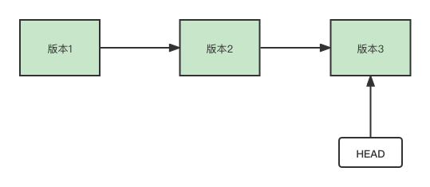
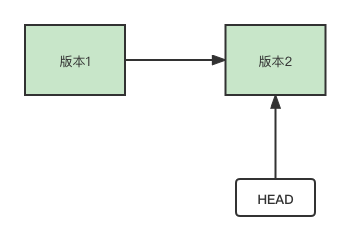

# git版本库的代码回退技巧

## 一、概述

本文是该系列文章的第四篇，你可以通过以下链接阅读之前的内容

[git的简介与基本操作方法](https://blog.jkdev.cn/index.php/archives/351/)

[通俗易懂地学习git中最常用的指令](https://blog.jkdev.cn/index.php/archives/359/)

[怎样使用git进行协同开发？](https://blog.jkdev.cn/index.php/archives/481/)

git能帮助我们高效地进行代码托管，在使用git进行代码托管的时候，有时候我们需要回退版本。本文我们将一起来研究代码回退的方法。在git中，`HEAD`指针指向我们当前分支的最后一次提交。比如我们提交过三个版本，那么此时`HEAD`指针位置如下图



git版本回退会变更HEAD指针的位置，本文中，我们分别介绍两种代码回退的方式。

## 二、git revert 指令

`git revert` 指令会撤回某次提交（commit）。这个指令触发的代码回退并不会真正地删除掉代码提交历史，而是将撤回操作作为新的一次提交记录。如下图


相关指令如下

如果要撤回上一个版本的提交

```shell
git revert HEAD^
```

回退到上上个版本

```shell
git revert HEAD^^
```

或者写成以下这个格式

```shell
git revert HEAD^2
```

以此类推...可以撤回到很多版本之前

如果要撤回具体某个版本的提交，可以使用以下命令格式

```shell
git revert 版本ID
```

## 三、git reset 指令

`git reset`指令的作用是重置HEAD的位置，将代码重置到某个版本。即将HEAD指向的位置改变为之前存在的某个版本，而后面的提交记录会被删除。如下图



命令语法格式如下：

```shell
git reset [--soft | --mixed | --hard] [HEAD]
```

其中，HEAD对应的值和`git revert`指令一样，可以使用多个`^`符号，也可以使用`^`+数字的形式。该指令有几个模式，分别是`mixed`、`soft`、`hard`。

`--mixed` 为默认，可以不用带该参数，用于重置版本库中的文件与某一次的提交(commit)保持一致，工作区文件内容保持不变。如下示例

```shell
git reset HEAD             # 重置当前版本，即撤回git add 操作
git reset HEAD^            # 重置所有内容到上一个版本  
git reset HEAD^ hello.php  # 重置 hello.php 文件的版本到上一个版本  
git  reset  052e           # 重置到指定版本
```

`--soft` 参数用于重置到某个版本。如下示例

```shell
git reset --soft HEAD^2 # 重置上上个版本
```

`--hard` 参数撤销工作区中所有未提交的修改内容，将暂存区与工作区都回到上一次版本，并删除之前的所有信息提交。如下示例

```shell
git reset –hard HEAD^3  # 重置上上上一个版本  
git reset –hard bae128  # 重置到某个版本。 
git reset --hard origin/master    # 将本地版本的状态重置到和远程的一样 
```

注意：谨慎使用 –hard 参数，它会删除重置点之前的所有信息。

上面几个参数可以存在以下区别

**--mixed(默认)**：将版本库的代码重置到某个版本，将重置的更改留在工作区中。这个模式只是重置git版本库中的版本，工作区中的代码不变。

**--soft**：将版本库的代码重置到某个版本，将重置的更改保存在暂存区。这个模式在重置git版本的同时，会改变工作区中代码，将变更的内容放在暂存区。如果我们确定重置，提交代码生成新版本即可。如果我们后悔了，依然可以找回版本重置前的代码，命令格式如下

```shell
# 撤回 git add 操作
git reset HEAD [被删除的文件或文件夹]
# 恢复工作区文件，checkout 指令也可以用于切换分支
git checkout  [被删除的文件或文件夹]
```

**--hard**：将版本库的代码重置到某个版本，删除变更的记录，一无所有。一般情况下，我们要谨慎使用**hard**模式，因为这种模式会丢失掉自己变动过的代码。
